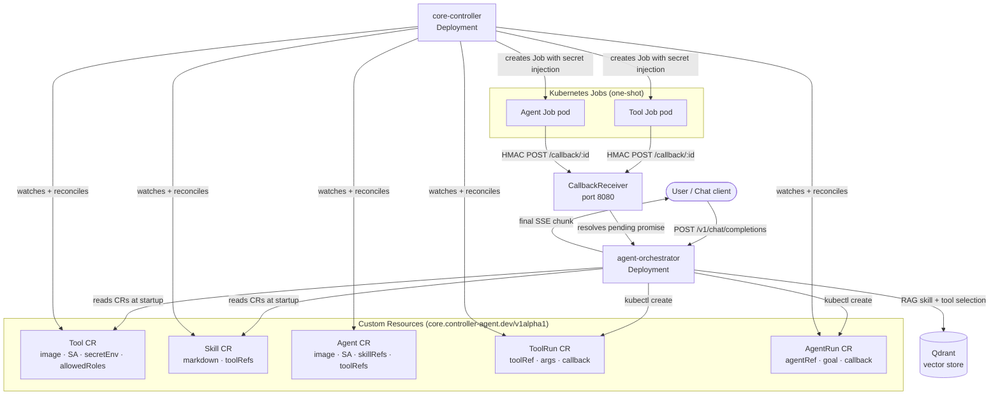

# agent-controller

> [github.com/imaustink/agent-controller](https://github.com/imaustink/agent-controller)

A Kubernetes-native framework for building production AI agents. Tools, Skills,
and Agents are declared as **custom resources** and launched as one-shot Jobs by
a dedicated controller — so operators manage the catalog declaratively and the
orchestrator stays focused on reasoning, not infrastructure.

## Why a controller + CRDs?

Hard-coding tool definitions and Job-launching logic inside an orchestrator
couples infrastructure concerns to application code: rotating a secret, tuning
resource limits, or adding a new tool all require an image rebuild and
redeployment. It also means the orchestrator's ServiceAccount needs broad
`batch/jobs create` permissions, every configuration change bypasses version
control, and there is no Kubernetes-native way to inspect what the agent has
been doing.

Modelling tools and agents as custom resources flips this:

| Concern | Baked into orchestrator | With core-controller |
| ------- | ----------------------- | ---------------------- |
| Tool definition | Config files / env vars | `Tool` CR — live-editable, `kubectl`-discoverable |
| Secret injection | Orchestrator builds the full Job spec | Declared once on the CR; controller injects at run time |
| Job RBAC | Orchestrator SA needs `batch/jobs create` | Controller's SA creates Jobs; orchestrator only needs `toolruns create` |
| Lifecycle visibility | Orchestrator polls Job status | `ToolRun.status.phase` + `conditions` — any cluster tenant can read |
| Skill / Agent catalog | Static code or restart-requiring config | `Skill` and `Agent` CRs — `kubectl apply`, no rebuild |
| Audit trail | Application logs only | Kubernetes events + per-invocation CR status |

**Operational benefits:**
- Change a tool's description, roles, or limits with `kubectl apply` — no image rebuild.
- Operators control the catalog; developers control the orchestrator. Neither needs the other's access.
- Tools and full sub-agent loops share one execution architecture. Adding a new workload kind is a new CRD, not new Job-launching code.
- `kubectl get toolruns`, `kubectl describe agentrun`, and standard controller metrics work out of the box.

## System architecture



This is an **npm workspace** monorepo: `packages/` holds shared libraries,
`tools/` holds on-demand tool containers, `apps/` holds the long-lived
orchestrator service, and `controllers/` holds the Go controller.

## Repository layout

```
.
├── README.md                   # this file — general overview & conventions
├── package.json                # npm workspaces root (packages/* + tools/* + apps/*)
├── docs/                       # shared standards every tool follows
│   ├── messaging.md            # event protocol & transports
│   ├── security.md             # threat model & mitigations
│   ├── orchestrator.md         # orchestrator architecture
│   ├── integrations-gateway.md # event integrations proposal (GitHub Issues implemented)
│   └── adr/                    # Architecture Decision Records
├── packages/
│   ├── messaging/              # @controller-agent/messaging — shared event protocol
│   └── github-app-auth/        # @controller-agent/github-app-auth — GitHub App JWT/token auth
├── tools/                      # on-demand tool containers (example implementations)
│   ├── recipe-scraper/         # URL → recipe Markdown
│   └── recipe-publisher/       # recipe Markdown → Mealie instance
├── apps/
│   ├── agent-orchestrator/     # RAG skill selection + ToolRun/AgentRun creator
│   └── integration-gateway/    # GitHub Issues → agent-orchestrator webhook adapter
├── controllers/
│   └── core-controller/        # Go controller — watches CRDs, launches Jobs
│       ├── api/v1alpha1/        # Tool, Skill, Agent, ToolRun, AgentRun types
│       └── internal/controller/ # reconciliation logic
└── charts/                     # Helm charts
    ├── agent-controller/       # system chart: orchestrator + core-controller (+ CRDs) + optional Redis/Qdrant/NATS/Open WebUI/integration-gateway
    └── community-components/   # catalog chart: Tool/Skill/Agent custom resources
```

General, cross-cutting documentation lives at the repo root (`README.md` and
`docs/`). Anything specific to a single tool — its inputs, configuration,
build/run steps, and troubleshooting — lives in that tool's own `README.md`.
Code shared by more than one tool belongs in `packages/`, not copied between
tools.

## Components

### Controller

| Component | Language | Docs |
| --------- | -------- | ---- |
| **core-controller** | Go (kubebuilder) | [controllers/core-controller/README.md](controllers/core-controller/README.md) |

The controller watches `Tool`, `Skill`, `Agent`, `ToolRun`, and `AgentRun` CRs
(API group `core.controller-agent.dev/v1alpha1`) and manages all Job creation,
secret injection, and lifecycle tracking.

### Orchestrator

| App | Docs |
| --- | ---- |
| **agent-orchestrator** | [apps/agent-orchestrator/README.md](apps/agent-orchestrator/README.md) |

A long-lived LangGraph.js service that handles the agent loop: resolves caller
identity, selects a Skill via RAG, plans an action, and creates a `ToolRun` or
`AgentRun` CR for the controller to execute.

### Example tools

| Tool | Input | Output | Docs |
| ---- | ----- | ------ | ---- |
| **recipe-scraper** | any recipe URL (web page, video, or image) | recipe Markdown | [tools/recipe-scraper/README.md](tools/recipe-scraper/README.md) |
| **recipe-publisher** | recipe Markdown | published/updated recipe in a Mealie instance | [tools/recipe-publisher/README.md](tools/recipe-publisher/README.md) |

## Shared standards

Every tool container is expected to conform to these repo-wide standards:

- **[Message passing](docs/messaging.md)** — the event protocol
  (`accepted → progress* / warning* → succeeded | failed`), the transports
  (stdout / file / HTTP callback), and the correlation/idempotency rules.
  Implemented once as the [@controller-agent/messaging](packages/messaging/) package.
- **[Security model](docs/security.md)** — SSRF defense, prompt-injection
  containment, the hardened container run contract, and secret handling.

`recipe-scraper` is the reference implementation of both standards.

## Deploying

Two independent Helm charts cover the full system:

| Chart | What it installs |
| ----- | ---------------- |
| [charts/agent-controller](charts/agent-controller/) | The system: CRDs + core-controller operator Deployment/RBAC, the agent-orchestrator Deployment/Services, and optional Redis/Qdrant/NATS/Open WebUI |
| [charts/community-components](charts/community-components/) | The catalog: Tool/Skill/Agent custom resources (recipe-scraper, recipe-publisher, recipe-refining skill, opencode-swe-agent) |

Install `agent-controller` first (it owns the CRDs), then
`community-components` on top of it. See each chart's README for
prerequisites and values. Tools are never deployed as long-running pods — the
controller launches them as one-shot Jobs via `ToolRun`/`AgentRun` CRs.

From a local checkout:

```bash
helm install agent-controller charts/agent-controller -n controller-agent --create-namespace
helm install community-components charts/community-components -n controller-agent
```

Both charts are also published as OCI artifacts to GitHub Container Registry
on every merge to `main` that touches `charts/**` (see
[.github/workflows/publish-charts.yml](.github/workflows/publish-charts.yml)),
so you can install without cloning the repo:

```bash
helm install agent-controller oci://ghcr.io/imaustink/charts/agent-controller --version 0.1.0 \
  -n controller-agent --create-namespace
helm install community-components oci://ghcr.io/imaustink/charts/community-components --version 0.1.0 \
  -n controller-agent
```

### Minikube quick-start

[scripts/dev-up.sh](scripts/dev-up.sh) automates the full local deploy (start
minikube, build images, install/upgrade both Helm releases, apply CRs). The
only step it can't do for you is creating secrets — do this once per fresh
cluster, in your own terminal (never paste real secrets into chat or files):

```bash
# Generate a random callback HMAC secret
CALLBACK_SECRET=$(openssl rand -hex 32)

kubectl create namespace controller-agent

# OpenAI key + callback HMAC secret (used by the orchestrator)
kubectl -n controller-agent create secret generic agent-orchestrator-secrets \
  --from-literal=OPENAI_API_KEY=<your-openai-api-key> \
  --from-literal=AGENT_CALLBACK_SECRET="$CALLBACK_SECRET"

# Mealie long-lived API token (create at /user/profile/api-tokens in your Mealie instance)
kubectl -n controller-agent create secret generic recipe-publisher-secrets \
  --from-literal=MEALIE_API_TOKEN=<your-mealie-api-token>

# Google OAuth client secret (from Google Cloud Console)
kubectl -n controller-agent create secret generic agent-orchestrator-openwebui-google-oauth \
  --from-literal=client-secret=<your-google-oauth-client-secret>
```

Then run:

```bash
./scripts/dev-up.sh
```

These secrets survive normal minikube `stop`/`start` cycles. If the minikube
container is ever deleted (e.g. after `minikube delete`), all secrets are lost
and must be re-created before running the script again.

## Adding a new tool

1. Create `tools/<tool-name>/` with its own `Dockerfile`, source, and `README.md`.
2. Add it to the root `package.json` workspaces (covered by the `tools/*` glob)
   and depend on [@controller-agent/messaging](packages/messaging/) for the
   [event protocol](docs/messaging.md) — see
   `tools/recipe-scraper/src/messaging/index.ts` for the wiring pattern.
3. Follow the [security model](docs/security.md): treat all input as untrusted,
   guard outbound requests (SSRF), constrain any LLM output, ship a hardened
   `run.sh`.
4. If the Dockerfile depends on a `packages/*` library, build from the **repo
   root**: `docker build -f tools/<tool-name>/Dockerfile -t <name>:latest .`
5. Create a `Tool` CR in `tools/<tool-name>/tool.yaml` referencing the image
   and any required `secretEnv` entries, then `kubectl apply -f` it — the
   controller picks it up immediately, and the orchestrator indexes it on next
   restart. No manifest file, no orchestrator rebuild required (ADR 0010).
6. Document tool-specific inputs, config, and build/run steps in the tool's
   `README.md`.

## Conventions

- **Language:** TypeScript (Node, ESM). Prefer it unless a tool's core
  dependencies dictate otherwise.
- **Isolation:** each tool is self-contained (its own dependencies, image, and
  run contract); tools do not import from one another.
- **Untrusted by default:** a tool never trusts its input or the content it
  fetches, and never needs more secrets than the single credential its job
  requires.
