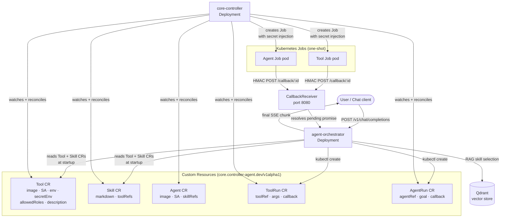

# core-controller

> Part of [github.com/imaustink/agent-controller](https://github.com/imaustink/agent-controller)

A Kubernetes controller that makes AI agents and tools **first-class cluster
citizens**. Instead of hard-coding agent behaviour into application code, you
declare **Tools**, **Skills**, **Agents**, and their invocation records
(**ToolRun** / **AgentRun**) as Kubernetes custom resources. The controller
watches those resources and owns all Job creation, secret injection, and
lifecycle tracking — the orchestrator only needs to create a CR and wait for
the result.

## Why a controller + CRDs?

### The problem with ad-hoc Job launching

When an LLM orchestrator launches tool containers directly via the Kubernetes
API, every concern — secret injection, RBAC, resource limits, retry policy,
result correlation — must be implemented and audited inside the orchestrator
itself. Changing any of those concerns requires redeploying the orchestrator.
Worse, the authoritative definition of a tool (its image, service account,
required secrets) lives in application code rather than the cluster, making
drift between declaration and reality invisible.

### What CRDs give you

| Concern | Without a controller | With core-controller |
| ------- | -------------------- | ---------------------- |
| Tool definition | Baked into orchestrator config / manifest files | `Tool` CR — live-editable, version-controlled, `kubectl`-discoverable |
| Secret injection | Orchestrator constructs the full Job spec including secret refs | Declared once on the `Tool` CR; controller injects at run time |
| Job RBAC | Orchestrator's ServiceAccount must have `batch/jobs create` | Controller's SA creates Jobs; orchestrator only needs `toolruns create` |
| Lifecycle visibility | Orchestrator polls Job status | `ToolRun.status.phase` and `conditions` — readable by any cluster tenant |
| Skill/Agent catalog | Static code or config files | `Skill` and `Agent` CRs — patch in-place, no image rebuild |
| Audit trail | Application logs only | Kubernetes events + CR status per invocation |

### Operational benefits

- **Live updates without rebuilds.** Changing a tool's description, RBAC
  roles, or resource limits is a `kubectl apply` — the orchestrator picks up
  the change on its next startup (or watch cycle, once a watch loop is added).
- **Separation of concerns.** Operators control what tools exist and what
  secrets they need. Developers control the orchestrator logic. Neither group
  needs access to the other's concerns.
- **Uniform execution model.** Tools and full agent loops (sub-agents) share
  the same Job-per-invocation execution architecture. The controller
  implements the pattern once; adding a new kind of workload is a new CR
  kind, not new Job-launching code.
- **Kubernetes-native observability.** `kubectl get toolruns`, `kubectl
  describe agentrun`, and standard controller-manager metrics work out of the
  box — no custom dashboards required to see what the agent has been doing.

## System architecture



## Custom resource kinds

### `Tool` — a single-shot tool container

Declares everything the controller needs to launch a tool as a one-shot Job.
The orchestrator discovers `Tool` CRs at startup, embeds their
`description`/`input`/`output` text into Qdrant for RAG retrieval, and
filters candidates by `allowedRoles` against the caller's identity.

```yaml
apiVersion: core.controller-agent.dev/v1alpha1
kind: Tool
metadata:
  name: recipe-scraper
  namespace: controller-agent
spec:
  description: Extracts a structured recipe from a URL and returns Markdown.
  input: A publicly accessible recipe URL.
  output: Recipe formatted as Markdown (title, ingredients, directions, equipment, tips).
  allowedRoles: [reader, writer]
  image: recipe-scraper:latest
  serviceAccountName: recipe-scraper
  secretEnv:
    - name: OPENAI_API_KEY
      secretRef:
        name: agent-orchestrator-secrets
        key: OPENAI_API_KEY
```

### `ToolRun` — one invocation of a Tool

Created by the orchestrator per tool call. The controller watches it, builds
a hardened Job spec (secret injection, `imagePullPolicy: IfNotPresent`,
resource limits, `activeDeadlineSeconds`), and mirrors the Job's phase into
`ToolRun.status.phase`.

### `Skill` — a named agent capability

A `Skill` pairs a system-prompt `markdown` blob (trusted, operator-authored
instructions for the action planner) with a list of `toolRefs` the skill is
permitted to invoke. It carries no `allowedRoles` of its own — its effective
audience is derived as the intersection of its tools' `allowedRoles` (ADR
0011), so RBAC lives exclusively on the dangerous things.

### `Agent` — a full agent loop as a Job

An `Agent` is structurally identical to a `Tool` but its container runs a
full agent loop (e.g. the `agent-orchestrator` image in scoped sub-agent
mode) instead of a single-shot tool. Launched via `AgentRun` CRs using the
same execution architecture.

### `AgentRun` — one invocation of an Agent

Like `ToolRun` but the payload is a natural-language `goal` rather than
positional args.

## Result reporting

Tools and agents report results over the
[@controller-agent/messaging](../../packages/messaging/) HMAC callback protocol
(ADR 0006): the controller injects `RECIPE_CALLBACK_URL` and
`RECIPE_CALLBACK_SECRET` into every Job, and the container POSTs signed
event payloads back to the orchestrator's callback receiver on port 8080.
The `ToolRun`/`AgentRun` status phase (derived from the owned Job) is the
authoritative lifecycle signal; callback payloads carry the actual result
content.

## Getting Started

### Prerequisites

- Go v1.24.6+
- Docker 17.03+
- kubectl v1.11.3+
- Kubernetes v1.11.3+ cluster (local: minikube with Docker driver)

### Building locally (minikube)

Build straight into minikube's Docker daemon — no registry push needed with
`imagePullPolicy: IfNotPresent`:

```sh
eval $(minikube docker-env)
docker build -f controllers/core-controller/Dockerfile   -t core-controller:latest controllers/core-controller/
```

### Installing CRDs

```sh
# From controllers/core-controller/
make install
```

Or apply the synced copy in the Helm chart directly:

```sh
kubectl apply -f ../../charts/agent-controller/charts/core-controller/crds/
```

> **Note:** That `crds/` directory is generated, not committed (see its
> README.md) — run `make manifests` (or `make sync-crds` if
> `config/crd/bases/` is already current) to populate it first. Helm's
> `crds/` directory is also install-only — `helm upgrade` never updates CRDs
> already on the cluster. After any `*_types.go` change, run `make
> manifests`, then `kubectl apply -f
> ../../charts/agent-controller/charts/core-controller/crds/<changed>.yaml`
> by hand.

### Deploying

```sh
make deploy IMG=<registry>/core-controller:tag
```

Or via the bundled Helm chart:

```sh
helm install core-controller charts/core-controller -n controller-agent
```

### Applying sample resources

```sh
kubectl apply -k config/samples/
```

### To Uninstall

```sh
kubectl delete -k config/samples/
make uninstall
make undeploy
```

## Development

### After editing `*_types.go`

```sh
make generate   # regenerate DeepCopy methods (zz_generated.deepcopy.go)
make manifests  # regenerate CRDs + RBAC from kubebuilder markers, and sync them into the Helm chart's crds/ dir
```

### Running tests

```sh
make test
```

### Lint

```sh
make lint-fix
```

## Project layout

```
controllers/core-controller/
  api/v1alpha1/
    tool_types.go          Tool + ToolRun CRD schemas
    skill_types.go         Skill CRD schema
    agent_types.go         Agent + AgentRun CRD schemas
    agentrun_types.go
    toolrun_types.go
    zz_generated.deepcopy.go  (auto-generated — do not edit)
  internal/controller/
    tool_controller.go     Reconciles Tool CRs
    toolrun_controller.go  Reconciles ToolRun CRs → creates Jobs
    skill_controller.go    Reconciles Skill CRs
    agent_controller.go    Reconciles Agent CRs
    agentrun_controller.go Reconciles AgentRun CRs → creates Jobs
    run_job.go             Shared hardened Job-spec builder
  config/crd/bases/        Generated CRDs (do not edit directly)
  config/samples/          Example CRs
  Dockerfile
  Makefile
```

## License

Copyright 2026.

Licensed under the Apache License, Version 2.0 (the "License");
you may not use this file except in compliance with the License.
You may obtain a copy of the License at

    http://www.apache.org/licenses/LICENSE-2.0

Unless required by applicable law or agreed to in writing, software
distributed under the License is distributed on an "AS IS" BASIS,
WITHOUT WARRANTIES OR CONDITIONS OF ANY KIND, either express or implied.
See the License for the specific language governing permissions and
limitations under the License.
