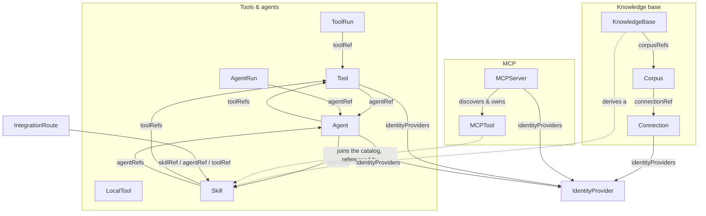

# Custom resource reference

Every workload and every piece of catalog in this system is a Kubernetes custom
resource in the group **`core.controller-agent.dev/v1alpha1`**. They are all
**namespaced**. The CRD definitions ship in the `core-controller` chart's
install-only `crds/` directory (generated from
`controllers/core-controller/api/v1alpha1/*_types.go`), so installing that chart
registers every kind below.

Two kinds of actor reconcile them:

- **The `core-controller` operator** (`controllers/core-controller`) watches most
  kinds. Only `ToolRun` and `AgentRun` create Kubernetes Jobs; `Corpus` creates a
  sync CronJob; every other controller only validates the spec and sets a `Ready`
  condition.
- **Out-of-cluster brokers.** The `connection-broker` reads `Connection`/`Corpus`
  for ingestion and retrieval; the `mcp-broker` owns `MCPServer`/`MCPTool`
  entirely (there is **no** in-cluster controller for those two — see
  [ADR 0045](adr/0045-mcp-server-proxied-tools.md)). The `agent-orchestrator` and
  the Temporal `catalog-sync` process read the catalog kinds into a vector store
  for RAG retrieval.

Most kinds are **operator-authored** (hand-deployed catalog / gitops). Three are
**system-written**: `ToolRun` and `AgentRun` (one per invocation, created by the
orchestrator) and `MCPTool` (derived and owned by the `mcp-broker`). `Skill` is
usually operator-authored but is also **derived** from each `KnowledgeBase`.

## At a glance

| Kind | Purpose | Authored by | Acted on by | Defining ADR |
| --- | --- | --- | --- | --- |
| [Tool](#tool) | A catalog capability: a container Job or an agent-backed tool | operator | tool_controller + orchestrator | [0010](adr/0010-crd-catalog-and-tool-controller.md) |
| [LocalTool](#localtool) | A catalog tool run as packaged code in an in-pod sidecar | operator | localtool_controller + orchestrator | [0014](adr/0014-local-tool-sidecar-execution.md) |
| [ToolRun](#toolrun) | One tool invocation → a Job | system (orchestrator) | toolrun_controller | [0010](adr/0010-crd-catalog-and-tool-controller.md) |
| [Agent](#agent) | A full agent loop launched as a Job | operator | agent_controller + orchestrator | [0002](adr/0002-langgraph-agent-loop.md) |
| [AgentRun](#agentrun) | One agent invocation → a Job | system (orchestrator) | agentrun_controller | [0021](adr/0021-skill-agent-refs.md) |
| [Skill](#skill) | Trusted markdown + an allowed tool/agent set | operator (or derived) | skill_controller + orchestrator | [0008](adr/0008-skill-mediated-tool-retrieval.md) |
| [Connection](#connection) | An authenticated route to one external system | operator | connection_controller + connection-broker | [0043](adr/0043-connection-corpus-knowledgebase.md) |
| [Corpus](#corpus) | One scoped subset of a Connection, indexed for RAG | operator | corpus_controller + connection-broker | [0043](adr/0043-connection-corpus-knowledgebase.md) |
| [KnowledgeBase](#knowledgebase) | A queryable composition of Corpora | operator | knowledgebase_controller + orchestrator | [0039](adr/0039-knowledgebase-crd-composed-corpora.md) |
| [MCPServer](#mcpserver) | An authenticated route to one MCP server | operator | **mcp-broker** (no in-cluster controller) | [0045](adr/0045-mcp-server-proxied-tools.md) |
| [MCPTool](#mcptool) | A proxied MCP tool, materialized into the catalog | **system (mcp-broker)** | **mcp-broker** (no in-cluster controller) | [0045](adr/0045-mcp-server-proxied-tools.md) |
| [IntegrationRoute](#integrationroute) | Deterministic inbound-event → target dispatch | operator | integrationroute_controller + orchestrator | [0024](adr/0024-integration-route-crd-for-deterministic-event-routing.md) |
| [IdentityProvider](#identityprovider) | How a per-user credential is resolved and injected | operator | identityprovider_controller + orchestrator | [0032](adr/0032-tool-level-identity-delegation-and-github-cli-tool.md) |

## How they relate

---

## Tools & execution

### Tool

A catalog entry for an invokable capability — either a **container tool**
(`image` + `serviceAccountName`, launched as a `ToolRun` Job) or an
**agent-backed tool** (`agentRef`, dispatched as an `AgentRun`). Supersedes the
former JS `manifest.json` ([ADR 0009](adr/0009-static-build-time-tool-manifests.md),
[0010](adr/0010-crd-catalog-and-tool-controller.md)).

- **Authored by:** operator.
- **Key spec fields:**
  - `description` (string, **required**) — embedded for RAG tool retrieval.
  - `input` / `output` (string, required) — the argv/stdin contract and result shape.
  - `allowedRoles` ([]string, **required**, ≥1) — RBAC retrieval filter; the caller needs at least one.
  - `tier` (string) — cost/trust class.
  - `agentRef` (string) — names an `Agent` this tool wraps.
  - `image` + `serviceAccountName` (string) — container launch target (the SA must pre-exist).
  - `args` / `env` / `secretEnv` / `resources` / `timeoutSeconds` — Job container config; `secretEnv` sources from Secret keys, never literals.
  - `identityProviders` ([]string) — `IdentityProvider` CRs the caller must have linked.
  - **CEL:** exactly one of `agentRef` **or** (`image` **and** `serviceAccountName`).
- **Status:** `Ready` condition.
- **Referenced by:** `Skill.toolRefs`, `Agent.toolRefs`, `IntegrationRoute.toolRef`, `ToolRun.toolRef`.
- **Acted on by:** `tool_controller.go` (validates the launch target); orchestrator (retrieval + dispatch).
- **Sample:** `config/samples/tool_v1alpha1_tool.yaml`.

### LocalTool

Like a `Tool`, but it points at **packaged code pulled from a language registry at
runtime** and run by a per-language executor **sidecar** in the orchestrator pod —
never a Job ([ADR 0014](adr/0014-local-tool-sidecar-execution.md)). Creating one
is **privileged** (it fetches and runs third-party code): gate it with k8s RBAC.

- **Authored by:** operator (privileged).
- **Key spec fields:**
  - `description` / `input` / `output` / `allowedRoles` (≥1) / `tier` — same catalog semantics as `Tool`.
  - `runtime` (string, **required**, enum `node;python;go;shell`) — selects the executor sidecar.
  - `package` + `version` — registry coordinate and **exact** pinned version (ranges/tags are rejected fail-closed); required for node/python/go.
  - `entry` — module/console-script/binary when it differs from the package default.
  - `sourceURL` + `checksum` — required for `shell` (no registry); sha256 verified before run.
  - `env` / `secretEnv` (orchestrator resolves secrets and passes them over the pod-local unix socket), `resources`, `timeoutSeconds`.
  - `network` (bool, default false) — opt-in egress; otherwise the sidecar unshares the network namespace.
- **Status:** `Ready` condition (spec validity only).
- **Acted on by:** `localtool_controller.go` (validates cross-field packaging constraints); the orchestrator's per-language sidecars execute it.
- **Sample:** none.

### ToolRun

**One tool invocation.** The orchestrator creates a `ToolRun` instead of a Job
directly, so the controller owns all Job creation and RBAC
([ADR 0010](adr/0010-crd-catalog-and-tool-controller.md)).

- **Authored by:** system — created by the orchestrator per invocation.
- **Key spec fields:**
  - `toolRef` (string, **required**) — the `Tool` to launch.
  - `args` ([]string) — appended after the Tool's static args.
  - `callback` (**required**) — exactly one delivery mode: HTTP (`url` + HMAC `secretRef`) or NATS (`natsSubject` + `natsUrl`).
  - `secretEnv` ([]SecretEnvVar) — per-invocation secrets, merged over the Tool's (run entry wins on a name clash) — e.g. a per-user token.
  - `timeoutSeconds` (int32, default 300).
- **Status:** `phase` (enum `Pending;Running;Succeeded;Failed`, derived from the owned Job), `jobName`, `startTime`, `completionTime`, `message`, `conditions`.
- **Acted on by:** `toolrun_controller.go` (owns a `batch/v1` Job).
- **Sample:** `config/samples/tool_v1alpha1_toolrun.yaml`.

---

## Agents

### Agent

A full agent loop launched as a one-shot Job — same execution architecture as a
`Tool`, but given a natural-language goal at runtime and iterating internally
before reporting a final answer over the callback protocol. Its catalog half
mirrors `Tool` so agents join the same RBAC-scoped retrieval
([ADR 0002](adr/0002-langgraph-agent-loop.md), [0021](adr/0021-skill-agent-refs.md)).

- **Authored by:** operator.
- **Key spec fields:**
  - `description` / `input` / `output` / `allowedRoles` (≥1) / `tier` — catalog fields.
  - `image` + `serviceAccountName` (**required**; SA must pre-exist).
  - `orchestratorPrompt` — guidance for the **parent** planner about when to delegate here.
  - `agentPrompt` — the system prompt the **sub-agent's** own loop runs with.
  - `skillRefs` ([]string) — `Skill` CRs this agent may load.
  - `toolRefs` ([]string) — `Tool` CRs this agent's own loop may call ([ADR 0028](adr/0028-agent-tool-refs-sub-agent-tool-calls.md)).
  - `model` (advisory), `maxIterations`, `env` / `secretEnv` / `resources`, `initContainers`.
  - `identityProviders` ([]string).
- **Status:** `Ready` condition.
- **Referenced by:** `Tool.agentRef`, `Skill.agentRefs`, `IntegrationRoute.agentRef`, `AgentRun.agentRef`.
- **Acted on by:** `agent_controller.go`; launched via `AgentRun` by the orchestrator.
- **Sample:** `config/samples/tool_v1alpha1_agent.yaml`.

### AgentRun

**One agent invocation** — the `ToolRun` pattern, but the payload is a
natural-language `goal` and the target is an `Agent`.

- **Authored by:** system — created by the orchestrator (or another caller).
- **Key spec fields:** `agentRef` (**required**), `goal` (string, **required**), `callback` (**required**, reuses the ToolRun HMAC/NATS protocol), `secretEnv` (merged over the Agent's), `timeoutSeconds`.
- **Status:** same shape as `ToolRun` — `phase`, `jobName`, timings, `message`, `conditions`.
- **Acted on by:** `agentrun_controller.go` (owns a `batch/v1` Job).
- **Sample:** `config/samples/tool_v1alpha1_agentrun.yaml`.

---

## Skills

### Skill

Hand-authored, **trusted** markdown plus an allowed tool/agent set
([ADR 0008](adr/0008-skill-mediated-tool-retrieval.md)). A Skill is never run as a
pod; its markdown is injected as system-prompt context. It deliberately has **no
`allowedRoles`** — its audience is **derived** as the intersection of its
referenced tools' and agents' roles ([ADR 0011](adr/0011-skill-access-derived-from-tools.md)).

- **Authored by:** operator — and also **derived** from each `KnowledgeBase` ([ADR 0039](adr/0039-knowledgebase-crd-composed-corpora.md) §2).
- **Key spec fields:**
  - `description` (**required**) — RAG retrieval.
  - `markdown` (string, **required**) — trusted system-prompt content.
  - `toolRefs` / `agentRefs` ([]string) — the tools it may invoke and agents it may delegate to; the planner's choice is re-validated against these.
  - `allowCallerTools` (*bool) — governs caller-supplied tools ([ADR 0035](adr/0035-caller-supplied-tools-via-openai-facade.md)); **unset means allowed** (the OpenAI wire-contract default).
- **Status:** `Ready` condition.
- **Referenced by:** `Agent.skillRefs`, `IntegrationRoute.skillRef`.
- **Acted on by:** `skill_controller.go` (validates refs); the planner consumes the markdown.
- **Sample:** `config/samples/tool_v1alpha1_skill.yaml`.

---

## Knowledge base

The knowledge-base subsystem is a three-tier split
([ADR 0038](adr/0038-connection-crd-scoped-external-resources.md),
[0043](adr/0043-connection-corpus-knowledgebase.md)): a **Connection** is the
credentialed route, a **Corpus** is a scoped subset of it, and a
**KnowledgeBase** composes Corpora into the thing an agent queries. All three
live in one namespace with their credential Secrets; the `connection-broker` (not
the in-cluster controllers) does the actual listing, fetching and per-user
retrieval.

### Connection

An authenticated route to **one** external system — one per Slack workspace /
Confluence site / Drive account, not per channel or space. Holds the provider,
address and ingestion credential.

- **Authored by:** operator (holds the ingestion credential).
- **Key spec fields:**
  - `provider` (string, **required**, enum `confluence;slack;gdrive`).
  - `site` — `baseURL` (**required**, `^https://`, used for citations only) + `cloudId` (required for Confluence custom domains).
  - `allowedScopes` — an allowlist capping which subsets its Corpora may reach (`spaces` / `channels` / `folderIDs`).
  - `autoJoin` (bool, slack-only) — the credential self-joins a channel on a refused read (a write).
  - `secretEnv` — the shared-service **ingestion** credential.
  - `identityProviders` ([]string) — per-user **retrieval** delegation; copied into each Corpus status.
  - **CEL:** confluence ⇒ `site` required; `autoJoin` only for slack.
- **Status:** `corpora` (count of referencing Corpora — makes deletion refusable), `observedGeneration`, `Ready` condition.
- **Referenced by:** `Corpus.connectionRef`.
- **Acted on by:** `connection_controller.go` (ref-counts Corpora, blocks deletion while any remain); `connection-broker`.
- **Sample:** `config/samples/core_v1alpha1_connection.yaml` (+ `_slack`, `_gdrive`).

### Corpus

**One scoped subset** of a Connection — this Confluence space, this Slack channel,
this Drive folder. Several per provider are normal; each owns one vector-store
collection, stamped with the Corpus's roles at ingest.

- **Authored by:** operator; status fields are controller-written.
- **Key spec fields:**
  - `connectionRef` (string, **required**) — the Connection it draws from.
  - `description` (**required**); `displayName` (defaults to the name; distinct within a KB for citations).
  - `allowedRoles` ([]string, **required**, ≥1) — RBAC, stamped on every chunk.
  - `scope` (**required**) — exactly one of `space` / `channel` / `folderID`; the security boundary.
  - `sync` — `mode` (enum `webhook;poll;none`), `reconcileInterval`, `backfill.since`.
  - `api` — the live GET face: `enabled` (default false), `methods` (enum `GET`).
  - **CEL:** exactly one scope unit; `sync.reconcileInterval` required unless `mode: none`.
- **Status:** `provider` + `identityProviders` (copied from the Connection), `collection`, `resources` (indexed count), `lastSyncTime`, `lastReconcileTime`, `webhook`, `Ready` + `Synced` conditions.
- **Referenced by:** `KnowledgeBase.corpusRefs`.
- **Acted on by:** `corpus_controller.go` (owns a sync CronJob); `connection-broker` + the vector-store indexer.
- **Sample:** `config/samples/core_v1alpha1_corpus.yaml` (+ `_slack`, `_gdrive`).

### KnowledgeBase

Composes multiple Corpora into the queryable unit an agent asks (e.g. a client
engagement) — many-to-many. The indexer **derives a `Skill`** from it whose tools
are its search/fetch tools plus each member's GET face. Like `Skill` it has **no
`allowedRoles`**: its audience is the **union** of its members, enforced by
per-chunk role filtering at the vector store ([ADR 0039](adr/0039-knowledgebase-crd-composed-corpora.md) §4).

- **Authored by:** operator; status counts are controller-written.
- **Key spec fields:**
  - `description` (**required**) — the **subject matter**, so the planner can tell knowledge bases apart.
  - `displayName`, `aliases` (alternate names, embedded).
  - `corpusRefs` ([]string, **required**, ≥1, set) — the member Corpora (an explicit list, not a selector).
  - `chunk` — defaults for `maxTokens` (800) and `overlap` (100).
  - `disclosePartialVisibility` (*bool, default true) — report how many members were withheld by role.
  - **CEL:** `chunk.overlap < chunk.maxTokens`.
- **Status:** `documents` (total), `perCorpus` (per-member counts + sync times), `staleCorpora`, `missingCorpora` (dangling refs), `Ready` condition.
- **Acted on by:** `knowledgebase_controller.go` (aggregates counts/staleness); the indexer/orchestrator consume the derived Skill.
- **Sample:** `config/samples/core_v1alpha1_knowledgebase.yaml`.

---

## MCP

MCP support ([ADR 0045](adr/0045-mcp-server-proxied-tools.md)) exposes a Model
Context Protocol server's tools **without ever giving the agent loop an MCP
client**. The `mcp-broker` is the only component that speaks MCP: it discovers a
server's tools and materializes the exposed ones as ordinary catalog tools. These
two kinds have **no in-cluster controller** — the broker reconciles them.

### MCPServer

An authenticated route to one MCP server. **Operator-authored and privileged:**
it introduces an externally-controlled call path reachable by agents.

- **Authored by:** operator (privileged); `status` is written by the `mcp-broker`.
- **Key spec fields:**
  - `transport` (string, **required**, enum `streamable-http`).
  - `url` (string, **required**, `^https?://`) — the broker's endpoint; `https` for an external server, `http` permitted for a cluster-internal one.
  - `secretEnv` — the shared-service **discovery** credential (for `tools/list`).
  - `identityProviders` ([]string) — the per-user **invocation** credential, presented on `tools/call`; fails **closed**, never falling back to the discovery credential.
  - `exposure` ([]MCPToolExposure, default-**deny**, keyed by `remoteToolName`) — each entry: `remoteToolName` (**required**), `expose` (*bool, default true), `allowedRoles` (**required**, ≥1), `toolID` (optional, must be a DNS-1123 name), `hidden`, `tier`.
- **Status:** `discoveredTools` (the full advertised inventory, each marked `exposed`), `exposedTools` (count), `Ready`/Degraded conditions.
- **Owns:** the derived `MCPTool` CRs (via `ownerReferences`, so deletion cascades).
- **Acted on by:** the **`mcp-broker`** — there is no in-cluster controller.
- **Sample:** `config/samples/core_v1alpha1_mcpserver.yaml`.

### MCPTool

The catalog record a remote MCP tool becomes — an ordinary tool whose dispatch
kind is `mcpExec`, carrying what the broker needs to proxy one `tools/call`.
**Derived — do not edit:** the `mcp-broker` writes and owns these from an
`MCPServer`'s exposure map and reconciles any hand-edit back.

- **Authored by:** system — the `mcp-broker` (owner-referenced to its `MCPServer`).
- **Key spec fields:** `serverRef` (**required**), `remoteToolName` (**required**), `description` (**required**, RAG), `inputSchema` (the remote JSON Schema, verbatim), `allowedRoles` (**required**, ≥1, copied from the exposure entry), `hidden`, `tier`, `identityProviders` (copied from the server).
- **Status:** `Ready` condition (the owning server still advertises this remote tool; the broker deletes it otherwise — the §6 existence rule).
- **Referenced by:** `Skill.toolRefs` / `Agent.toolRefs`, by its catalog id (like any tool).
- **Acted on by:** the **`mcp-broker`** — no in-cluster controller.
- **Sample:** `config/samples/core_v1alpha1_mcptool.yaml`.

---

## Routing & identity

### IntegrationRoute

A declarative mapping from an inbound `integration-gateway` event to a target
Skill/Agent/Tool plus a prompt, so a trigger (e.g. a GitHub issue labeled for the
bot) dispatches **deterministically** instead of via RAG retrieval
([ADR 0024](adr/0024-integration-route-crd-for-deterministic-event-routing.md),
[docs/integrations-gateway.md](integrations-gateway.md)).

- **Authored by:** operator.
- **Key spec fields:**
  - `match` (**required**) — exact match (no globs): `source` + `event` (required), `action` (any if omitted), `labelName` (a route naming it wins over one that omits it).
  - `skillRef` / `agentRef` / `toolRef` — the dispatch target.
  - `promptTemplate` (string, **required**) — rendered with `{{field}}` substitution from the matched event.
  - **CEL:** exactly one of `skillRef` / `agentRef` / `toolRef`.
- **Status:** `Ready` condition.
- **Acted on by:** `integrationroute_controller.go` (validates the ref); the orchestrator dispatches on it.
- **Sample:** `config/samples/tool_v1alpha1_integrationroute.yaml`.

### IdentityProvider

Declares, once per provider (e.g. `github`), how the orchestrator resolves and
injects that provider's **per-user** credential. Replaced a hardcoded map in the
orchestrator so this is cluster config, watched like the catalog kinds
([ADR 0032](adr/0032-tool-level-identity-delegation-and-github-cli-tool.md)).

- **Authored by:** operator (cluster config).
- **Key spec fields:**
  - `envVar` (string, **required**, `^[A-Z][A-Z0-9_]*$`) — the env var the resolved token is injected as on a run's `secretEnv`.
  - `label` (string, **required**) — human-facing name in link prompts; unique per namespace.
  - `flow` (enum `oauth;claude-cli-setup-token;claude-remote-login`, default `oauth`) — which link flow backs it ([ADR 0027](adr/0027-per-user-claude-oauth-setup-token-delegation.md)).
  - `crossEntryPoint` (bool) — key the credential by principal vs raw entry-point subject ([ADR 0030](adr/0030-authorization-preflight-outside-the-llm.md) §6).
- **Status:** `conditions`.
- **Referenced by:** `Tool`, `Agent`, `Connection`, `MCPServer`, `MCPTool` — all via `identityProviders`.
- **Acted on by:** `identityprovider_controller.go` (uniqueness check only); the orchestrator reads it.
- **Sample:** none.

---

## Adding or changing a CRD

1. Edit the Go type in `controllers/core-controller/api/v1alpha1/<kind>_types.go`
   (the doc comments on each field are the source of truth for this reference).
2. Run `make manifests generate` in `controllers/core-controller` — this
   regenerates the CRD YAML, the deepcopy methods, and **syncs the CRD into the
   chart's `crds/`** automatically.
3. The chart's hand-maintained RBAC (`charts/.../rbac.yaml` for each process that
   watches the kind) is **not** generated — update it in the same change, and
   bump the umbrella `Chart.yaml` version so Argo re-renders.
4. Keep this reference in step with the new or changed fields.
