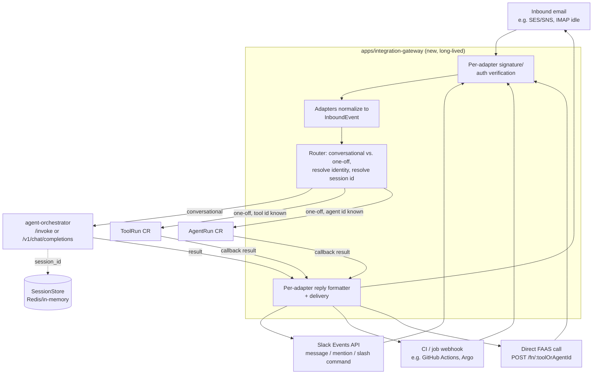

# Event Integrations & FAAS Gateway (design proposal)

> **Status:** the **conversational GitHub Issues path** described below is
> implemented — see [apps/integration-gateway](../apps/integration-gateway)
> and the "Implementation status" section at the end of this document. The
> declarative **`IntegrationRoute` CRD** (ADR 0024) is also implemented,
> letting a configured label applied to a GitHub issue dispatch
> deterministically instead of through RAG retrieval. The FAAS-style direct-invoke path, and
> every other channel (email, Slack, job webhooks), remain
> proposed/unimplemented. This document was originally
> written to the same standard as [orchestrator.md](orchestrator.md) and
> cross-referenced from [README.md](../README.md). It assumes familiarity
> with [orchestrator.md](orchestrator.md), [messaging.md](messaging.md), and
> [security.md](security.md); it does not repeat their content.

## Problem

Every consumer of this system today is a synchronous HTTP caller talking
directly to `agent-orchestrator`'s invoke API or OpenAI-compatible facade
(ADR 0006, ADR 0007). There is no supported way for **external events** —
an inbound email, a Slack message/mention, a CI job webhook, a scheduled
trigger — to reach a skill, tool, or agent. Separately, every existing entry
point goes through skill retrieval (ADR 0008): there is no path to invoke a
known tool or agent **directly by id**, the way a FAAS platform's
`POST /functions/:name/invoke` would. This proposal covers both, because
they share almost all of their plumbing:

1. **Event-driven integrations** — adapters that turn email/Slack/webhook/job
   events into agent input, and turn agent output back into a reply on the
   originating channel (a Slack thread reply, an email reply, a job status
   callback).
2. **A FAAS-style gateway** — a direct, catalog-driven invocation surface
   (`Tool`/`Agent` CR by id) for one-off tasks that don't need RAG skill
   selection at all, reusing the same `ToolRun`/`AgentRun` machinery
   (ADR 0010) that already exists.

Both conversational (multi-turn, session-scoped) and one-off (single request,
no session) interactions must be supported, and the adapter set must be
extensible without touching the orchestrator's reasoning graph.

## Goals

- Reuse the existing catalog (`Tool`/`Skill`/`Agent` CRs), launch mechanism
  (`ToolRun`/`AgentRun` + core-controller), and event protocol
  (`@controller-agent/messaging`) — this is new **entry points**, not a new
  execution model.
- One new component owns *all* channel-specific concerns (auth verification,
  payload parsing, reply formatting) so `agent-orchestrator`'s graph stays
  channel-agnostic, exactly as ADR 0007's chat facade keeps the graph
  transport-agnostic today.
- Support both interaction shapes from day one:
  - **Conversational**: an inbound event belongs to an ongoing thread
    (Slack thread ts, email `In-Reply-To`/`References`, chat session) and
    should resume that conversation's active skill (ADR 0012) and
    continuation state (ADR 0017).
  - **One-off / FAAS**: an inbound event (job webhook, scheduled trigger, a
    Slack slash-command-style invocation) names a specific tool or agent by
    id and skips skill retrieval entirely — closer to `POST /invoke` than to
    `/v1/chat/completions`.
- New channels are additive: adding Discord or MS Teams should mean adding an
  adapter, not modifying the orchestrator.
- Preserve the existing security posture: identity resolution stays
  fail-closed, RBAC filtering is unchanged, and every new inbound surface
  gets the same "untrusted external input" treatment `security.md` already
  applies to scraped content and callback bodies.

## Non-goals (for this proposal)

- Redesigning skill retrieval, RBAC, or the `ToolRun`/`AgentRun` execution
  model — all reused as-is.
- Picking the specific Slack/email SDKs — deferred to implementation.
- A general-purpose no-code workflow builder — routing config here is
  declarative but intentionally small (trigger → skill/tool/agent), not a
  full rules engine.

## Proposed architecture

### 1. `apps/integration-gateway` — a new long-lived service

A new app, following the existing convention (own image, own hardened run
contract, no direct imports from `agent-orchestrator` or any `tools/*`/
`apps/*` sibling — only from `packages/*`). It is the **only** thing that
knows about Slack/email/webhook specifics; `agent-orchestrator`'s graph is
never modified to accommodate a new channel.

Responsibilities, mirrored on the existing chat-facade split (ADR 0007) so
this is an additive sibling, not a rework:

- Terminate each channel's inbound transport (Slack Events API POST, an
  inbound-email webhook from an email-relay provider, a generic job/CI
  webhook, a direct FAAS-style HTTP call) behind **per-adapter signature
  verification** — Slack's signing secret, the email relay's shared secret,
  a bearer token / HMAC for job webhooks and the FAAS path. Unverified
  requests are rejected before any payload is parsed, same posture as
  `CallbackSink`'s HMAC check (messaging.md).
- Normalize each verified payload into one shared `InboundEvent` shape (see
  below) — the only thing routing/downstream code depends on.
- Decide **conversational vs. one-off** (see next section) and either
  forward to `agent-orchestrator`'s existing invoke/chat surface, or create a
  `ToolRun`/`AgentRun` directly.
- Receive the eventual result (via the existing async invoke poll, or via
  the existing messaging callback for direct `ToolRun`/`AgentRun`s) and
  format+deliver a reply on the originating channel (Slack thread reply,
  email reply, job-status comment/webhook, FAAS response body).

### 2. `InboundEvent` — the shared normalized shape

A small package-level type (candidate: a new `@controller-agent/messaging`
addition, or a sibling package if it grows independent versioning needs —
see [Open questions](#open-questions)) that every adapter produces and every
router/reply path consumes:

- `channel`: `"email" | "slack" | "job" | "faas" | ...` (extensible
  discriminator, one new adapter = one new value, no changes to existing
  ones).
- `externalThreadId`: adapter-defined conversation key (Slack thread ts +
  channel id, email `Message-Id`/`References` chain, job run id) —
  `undefined` for a genuinely one-off event.
- `callerIdentity`: adapter-resolved identity input (Slack user id + team,
  email `From`, job webhook's service identity/token subject) — handed to
  the *same* `resolveIdentity` RBAC step the orchestrator already runs
  (docs/orchestrator.md#3), never trusted directly for authorization.
  Identity resolution stays fail-closed exactly as it is today: an adapter
  that cannot map its caller to a known identity produces zero candidate
  tools, not an unfiltered one.
- `text`: the natural-language payload (email body, Slack message text, a
  FAAS call's freeform `input.text`), always treated as untrusted content
  per `security.md`, same as scraped content.
- `target` (optional): an explicit `{ kind: "tool" | "agent", id, args }` —
  present when the event already names what to run (a job webhook wired to
  a specific tool, a FAAS call to `/fn/:id`, a Slack slash command bound to
  one tool). When present, this **is** the one-off/FAAS path and skill
  retrieval is skipped entirely.
- `replyRef`: adapter-specific opaque data needed to deliver the eventual
  reply (Slack channel+thread, email `Message-Id` to reply against, job
  webhook callback URL, FAAS caller's poll id) — never inspected outside
  that adapter's own reply formatter.

### 3. Conversational path — reuses the orchestrator unchanged

When `target` is absent, the gateway treats the event exactly like an
Open WebUI chat turn (ADR 0007, ADR 0012):

- `externalThreadId` maps 1:1 onto the existing `session_id` concept — the
  gateway is simply another **producer** of a session id, alongside
  `X-OpenWebUI-Chat-Id`. No changes needed to `SessionStore`,
  `checkActiveAgentRun`, or continuation tokens (ADR 0017); a Slack thread or
  an email chain gets the same session-scoped active-skill and continuation
  behavior a chat client's conversation already gets.
- The gateway calls `agent-orchestrator`'s existing `POST /invoke` (or the
  chat-completions facade, if streaming narration is useful for a given
  channel) with `{ request: text, session_id: externalThreadId }` and the
  resolved bearer/identity forwarded the same way any other caller's is.
- On the async result (poll or a small internal notification, see
  [Open questions](#open-questions) on eliminating polling), the gateway's
  reply formatter for that channel turns the result into a Slack message,
  an email reply, etc.

This path adds **zero** new concepts to `agent-orchestrator` — it is a new
caller of an interface that already exists.

**GitHub Issues is the first implemented adapter for this path** — see
[Implementation status](#implementation-status).

### 4. One-off / FAAS path — direct `ToolRun`/`AgentRun`, skips retrieval

When `target` is present, the gateway skips the graph's retrieval/selection
steps entirely and creates the `ToolRun` or `AgentRun` CR directly — the same
CR, the same core-controller reconciliation, the same messaging callback
protocol a skill-selected tool call already uses (docs/orchestrator.md#4).
Concretely this is a small, focused component in the gateway (not a
dependency on `agent-orchestrator`'s process) that:

- Re-validates the caller's resolved roles against the target `Tool`/`Agent`
  CR's `allowedRoles` (the same defense-in-depth check already done at
  launch time today) — a job webhook or FAAS caller naming a tool id
  directly must still pass this check; naming it explicitly is not an
  authorization bypass.
- Creates the CR via `@kubernetes/client-node` exactly as
  `ContainerToolLauncher`/`ToolRunLauncher` does, with the gateway's own
  callback URL so the result routes back to the adapter's reply formatter
  instead of to `agent-orchestrator`.
- Returns the same async accept/poll contract as `POST /invoke` (ADR 0006)
  for the `faas` channel specifically (`POST /fn/:id` → `202 { id }`,
  `GET /fn/:id` polls) — this **is** the "FAAS gateway" from the problem
  statement: a thin, catalog-driven direct-invoke surface with no
  skill/LLM step in between, layered on infrastructure that already exists
  rather than a parallel implementation.

This reuses 100% of the hardened Job contract (`security.md`) and the
existing RBAC/launch code path; the only new code is "look up a CR by id and
launch it directly" instead of "an LLM chose which CR to launch." **Not
implemented** — see [Implementation status](#implementation-status).

### 5. Reply delivery

Symmetric to inbound: each adapter owns turning a terminal result (`succeeded`
`{ result }` / `failed { code, message }` from messaging.md's protocol) into
a channel-appropriate reply and owns its own outbound auth (Slack bot token,
outbound SMTP/relay credentials, job webhook's own callback contract). Same
treatment as `CallbackSink`'s outbound constraints (messaging.md): reply
targets come only from the adapter's own trusted config or the original
inbound event's `replyRef`, never from tool/agent output content, to avoid
turning a reply path into a new SSRF/exfil surface.

## What's reused vs. new

| Concern | Reused as-is | New |
| ------- | ------------ | --- |
| Tool/Skill/Agent catalog, RBAC filtering | `Tool`/`Skill`/`Agent` CRs, `CrdToolRegistry`, `resolveIdentity` | — |
| Skill retrieval, action planning | LangGraph graph, `VectorStore` | — |
| Job launching, hardening | `ToolRun`/`AgentRun` + core-controller | — |
| Container ↔ parent event protocol | `@controller-agent/messaging` (`Sink`, `CallbackSink`, `EventSchema`) | — |
| Session continuity, continuation tokens | `SessionStore`, ADR 0012, ADR 0017 mechanism | New producer of `session_id` (external thread id) |
| Consumer-facing HTTP pattern | ADR 0006 async accept/poll shape | Reused for the `faas` channel's `POST /fn/:id` |
| Channel-specific auth/parsing/reply | — | Per-adapter code in `apps/integration-gateway` |
| Direct-by-id tool/agent invocation | `ToolRun`/`AgentRun` launch mechanics | New "launch by id, skip retrieval" component |

## Security considerations (extends `security.md` and `orchestrator.md`)

- **Every inbound adapter is a new untrusted-input boundary.** Signature/
  auth verification happens before parsing, and a failed/missing signature
  is rejected outright — no adapter should have a "trust by default" mode.
- **Identity resolution stays fail-closed per channel.** An adapter that
  cannot confidently map its caller to a known identity must resolve to "no
  identity" (zero candidate tools), never a default/broad identity —
  consistent with the existing RBAC posture (docs/orchestrator.md#3).
- **`target`-based direct invocation is not an authorization bypass.** Naming
  a tool/agent id directly (job webhook, FAAS call) still goes through the
  same `allowedRoles` check a RAG-selected call goes through; the only thing
  skipped is retrieval/ranking, never RBAC.
- **External thread ids are guessable/spoofable**, same class of risk ADR
  0012 already documents for `X-OpenWebUI-Chat-Id`: sessions stay bound to
  the *resolved identity*, not the thread id, so a guessed Slack thread ts or
  forged `In-Reply-To` can't pull another caller's session.
  Continuation-token flows (ADR 0017) already exclude marker content from
  any LLM-visible transcript — the gateway must not reintroduce it into a
  reply.
- **Reply targets are adapter-config-derived, never content-derived** — see
  §5 above; mirrors the existing `CallbackSink` SSRF guard.
- **Email is the highest-risk channel** for prompt injection (arbitrary
  senders, arbitrary body content, potential HTML/attachments) — treat email
  body content with at least the scrutiny `security.md` gives scraped web
  content, and consider stripping/ignoring attachments in a first iteration
  rather than processing them.
- **Job/CI webhooks often carry elevated implicit trust** (they come from
  infrastructure, not end users) — resist the temptation to skip
  verification/RBAC for this adapter specifically; treat it identically to
  the others.

## Extensibility model

- New channel = new adapter module implementing `parse(rawRequest) →
  InboundEvent` and `reply(result, replyRef) → void`, registered in the
  gateway's adapter table. No changes to routing, `agent-orchestrator`, or
  other adapters.
- New "one-off" trigger shapes (e.g. a cron-style scheduled trigger with no
  inbound HTTP request at all) fit the same `InboundEvent` shape with a
  synthetic adapter that constructs one on a timer instead of parsing a
  request — router/launch code is unchanged.
- Routing configuration (which channel/trigger maps to which skill, tool, or
  agent by default) is a new `IntegrationRoute` CR (ADR 0024), so operators
  manage it the same `kubectl apply` way they already manage
  `Tool`/`Skill`/`Agent` (see README's "why CRDs" table). See
  [Implementation status](#implementation-status) for what's built.

## Open questions

- **Polling vs. push for gateway → adapter results.** `POST /invoke`'s async
  accept/poll (ADR 0006) fits a chat client polling its own request, but a
  gateway proxying for Slack/email doesn't want to poll indefinitely on a
  potentially slow tool. Likely answer: the gateway registers its own
  callback URL directly with the `ToolRun`/`AgentRun` (one-off path) or with
  `agent-orchestrator`'s equivalent for the conversational path — needs a
  small extension point on the invoke API to accept a callback URL
  *from the gateway itself* (a trusted first-party caller, not the
  caller-supplied-webhook SSRF risk ADR 0006 rejected for end users). The
  GitHub Issues adapter (below) works around this today with bounded
  polling; that's a stand-in, not the intended long-term answer.
- **Where `InboundEvent` and adapter interfaces live** — a new
  `packages/integrations` shared package (parse/reply contracts only, no
  channel SDKs) vs. keeping them inside `apps/integration-gateway` until a
  second consumer needs them. Given `packages/*` is meant for logic reused
  across workspace members (per repo conventions) and today there's exactly
  one consumer, starting inside the app and extracting later is likely
  lower risk.
- **Rate limiting / abuse controls per channel** — email and Slack are
  effectively open to anyone who can reach the webhook URL or DM the bot;
  needs a throttling story before general availability, separate from RBAC
  (RBAC governs *what* an identified caller can do, not *how often*).
- **Multi-tenant credential storage for outbound adapters** (Slack bot
  tokens per workspace, SMTP/relay credentials, per-tenant FAAS API keys) —
  likely k8s Secrets per adapter instance, consistent with existing secret
  handling (`security.md`), but the exact shape (one gateway per tenant vs.
  one gateway routing to many tenant credentials) is undecided.
- **Attachment/binary handling for email and Slack** — ties into the
  existing `ArtifactRef`/object-store roadmap item in `messaging.md`; likely
  the same mechanism, not a parallel one.

## Suggested phasing

1. **FAAS path first** (`apps/integration-gateway` with only the `faas`
   adapter): validates the direct-by-id `ToolRun`/`AgentRun` launch
   component and the async accept/poll extension in isolation, with no new
   external-trust surface (caller is already an authenticated API client).
   **Not implemented** — the GitHub Issues adapter was prioritized instead
   (see below) since it exercises the conversational path end-to-end.
2. **One adapter for the conversational path.** Implemented for **GitHub
   Issues** rather than Slack (see [Implementation
   status](#implementation-status)) — validates the `InboundEvent`/
   `SessionStore` integration end to end via a different, equally
   well-documented webhook + signature-verification API.
3. **Email adapter**: highest-risk channel, built once the injection/
   untrusted-content handling patterns are proven out.
4. **Job/CI webhook adapter**, once real trigger-routing needs beyond GitHub
   Issues are concrete rather than speculative. The `IntegrationRoute` CRD
   itself (ADR 0024) is implemented, validated by a GitHub `issues.labeled`
   → `opencode-swe-agent` route (see [Implementation
   status](#implementation-status)).

Each phase should land as its own ADR once concrete, per this repo's existing
convention (see [docs/adr/](adr/)).

## Implementation status

**Implemented:** [apps/integration-gateway](../apps/integration-gateway) — a
GitHub Issues adapter for the conversational path only:

- `POST /webhooks/github` verifies GitHub's `X-Hub-Signature-256` HMAC, then
  handles `issues.opened`, `issue_comment.created`, and `issues.labeled`
  events.
- Session id is `github:<owner>/<repo>#<issueNumber>` — one session per
  issue, forwarded as `session_id` to `agent-orchestrator`'s existing
  `POST /invoke`. No `target`/FAAS shortcut: every event goes through normal
  RAG skill retrieval, so the existing `checkActiveAgentRun`/
  `AgentSession.ask()` mechanism (already built for `apps/opencode-swe-agent`)
  is what actually implements "ask a clarifying question, then resume on the
  next comment" — nothing new was built in the orchestrator for this.
- **`issues.labeled` → deterministic dispatch (ADR 0024).** When the
  gateway's configured trigger label (`GATEWAY_GITHUB_TRIGGER_LABEL`, e.g.
  `"ai-triage"`) is applied to a GitHub issue, the gateway relays it into the
  same conversational `/invoke` call as above, but attaches an `event`
  descriptor (`{ source: "github", event: "issues", action: "labeled",
  owner, repo, issueNumber, title, body, senderLogin, labelName }`). A
  label, not an assignee: GitHub App bot users generally cannot be set as
  issue assignees (only a small GitHub-owned allowlist, e.g.
  `dependabot[bot]`, gets that special-cased), so a configurable label is
  used instead. If the event matches an installed `IntegrationRoute` CR,
  `agent-orchestrator` bypasses RAG skill retrieval and dispatches straight
  to that route's target with its rendered `promptTemplate`
  (`CrdIntegrationRouteRegistry`, `checkIntegrationRoute` graph node) —
  deterministic, since applying a specific label is an unambiguous action
  rather than free text needing intent inference. No matching route falls
  back to ordinary RAG retrieval over a fallback request string, unchanged
  from before this feature existed. A sample route (`github`/`issues`/
  `labeled` → `opencode-swe-agent`) ships gated behind
  `integrationRoutes.githubIssueLabeledTriage.enabled`.
  - **Dedup with `issues.opened`**: GitHub fires a *separate* `issues.opened`
    delivery **and** one `issues.labeled` delivery per label already present
    when an issue is created with labels attached — the common case for this
    trigger (label set at creation time). Both would otherwise independently
    delegate the same session to the same agent (RAG picking it for `opened`,
    the deterministic route picking it for `labeled`), racing each other into
    two `AgentRun`s before either turn's session state is persisted. The
    gateway skips relaying `opened` whenever the issue's labels already
    include the configured trigger label, since the guaranteed-to-follow
    `labeled` event is the only one that needs to dispatch.
- Identity resolution's primary path is now real, no-redeploy-needed
  verification against GitHub itself, via two resolvers
  (`CompositeGithubIdentityResolver` tries both):
  `GithubTeamMembershipResolver` (`GATEWAY_GITHUB_TEAM_ROLES`) for org-owned
  repos, and `GithubCollaboratorPermissionResolver`
  (`GATEWAY_GITHUB_COLLABORATOR_ROLES`) for personal-account repos with no
  Organization to hang teams off of — it checks the sender's actual
  collaborator permission on the specific repo the webhook fired on instead.
  The dev/test-grade static allowlist (`GATEWAY_GITHUB_IDENTITIES`) still
  exists as a last-resort fallback for logins neither grants anything to,
  e.g. a service account that isn't and shouldn't be a team member or
  collaborator.
- Result delivery is **polling** `GET /invoke/:id`, not push — the "Polling
  vs. push" open question above is deliberately left unresolved and worked
  around with a bounded poll timeout.
- `@controller-agent/github-app-auth` (extracted from
  `apps/opencode-swe-agent`) is shared by both apps for GitHub App JWT
  signing / installation-token minting (ADR 0018), rather than duplicating
  that security-sensitive code.
- **Triage agent improvements (issue #81).** The `issues.labeled` path now
  posts an upfront "starting work" comment (rather than only replying once
  the whole turn completes) linking to a minimal server-rendered **session
  page** (`GET /sessions/:token`, `SessionPageStore` in
  `src/session-page-store.ts`) that shows that session's turn history and
  lets a caller `POST /sessions/:token/prompts` to send it a follow-up
  prompt without posting another GitHub comment. Ordinary conversational
  (non-labeled) replies are unaffected — this is scoped to the deterministic
  triage trigger only, since that's the long-running path where "is it
  actually working yet?" is a real question. `token` is a 256-bit
  bearer-capability credential (nothing else gates access to the page), and
  the whole feature is opt-in: unset `GATEWAY_PUBLIC_URL` (no configured
  public base URL) disables it entirely — no link is posted and the page
  routes are never wired up. State is Redis-backed when `SESSION_PAGE_REDIS_URL`
  (or the identity-link Redis instance) is set, in-memory otherwise (lost on
  a pod restart).

**Not implemented:** the FAAS/direct-invoke path (§4), and every other
channel (Slack, email, job webhooks).

## Related

- [orchestrator.md](orchestrator.md) — the reasoning loop and catalog this
  proposal is a new set of entry points into.
- [messaging.md](messaging.md) — the event protocol and callback security
  model reused for gateway ↔ Job/agent communication.
- [security.md](security.md) — the threat model every new adapter extends.
- [docs/adr/0006](adr/0006-async-http-invoke-interface.md),
  [0007](adr/0007-openai-compatible-chat-facade.md) — the existing
  consumer-facing interfaces this proposal builds on rather than replaces.
- [docs/adr/0012](adr/0012-session-scoped-skill-lifecycle.md),
  [0017](adr/0017-continuation-tokens-via-session-store.md) — the session/
  continuation mechanisms the conversational path reuses unchanged.
- [docs/adr/0018](adr/0018-github-app-auth-fallback.md) — the GitHub App
  auth mechanism `@controller-agent/github-app-auth` shares between
  `apps/opencode-swe-agent` and `apps/integration-gateway`.
