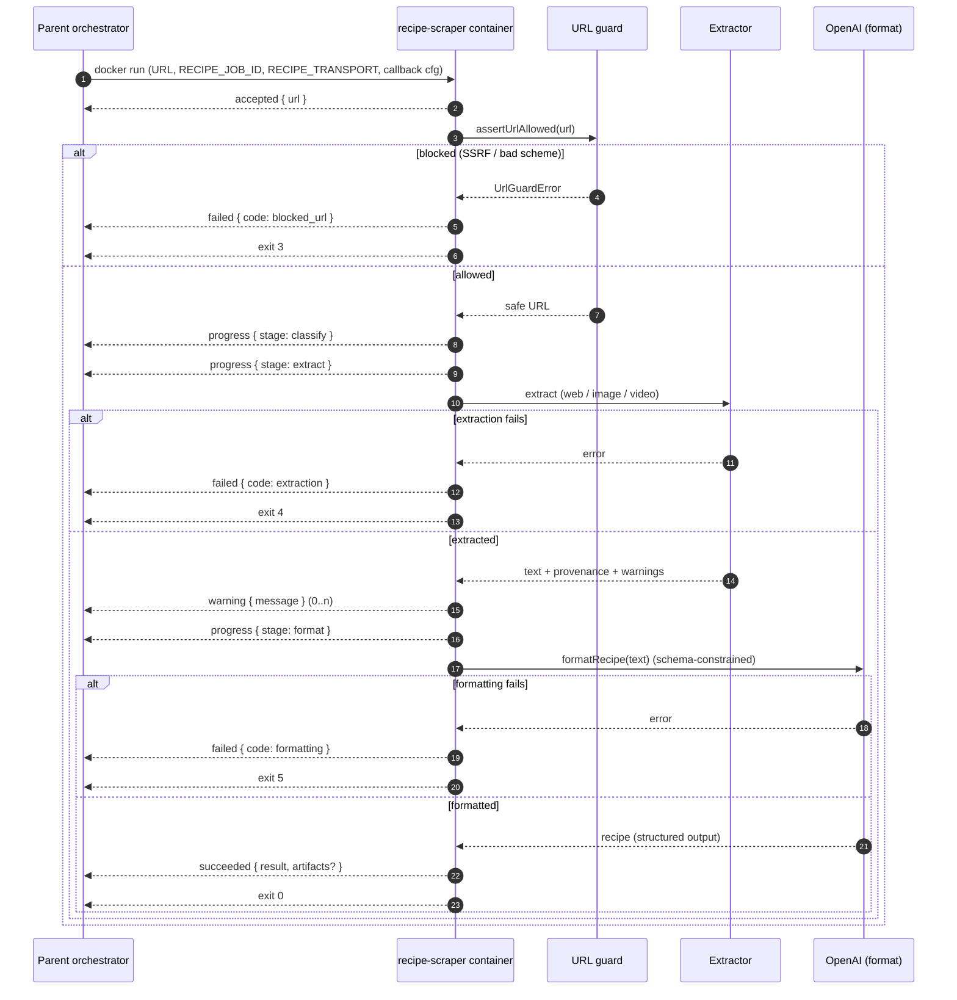

# Message Passing

How a tool-call container communicates with its parent orchestrator. Each
container is one ephemeral tool call: some input goes in, a stream of
structured events comes out.

The protocol is implemented **once**, as the shared
[@recipe-agent/messaging](../packages/messaging/) workspace package (`Sink`,
`JobEmitter`, `StdoutSink`/`FileSink`/`CallbackSink`, `EventSchema`). Any tool
depends on it rather than reimplementing the protocol; `recipe-scraper`
([tools/recipe-scraper/src/messaging/index.ts](../tools/recipe-scraper/src/messaging/index.ts))
is the reference example of the thin, tool-specific wiring layer on top (its
own result type, `Stage`/`ErrorCode` vocabulary, and stronger secret-redacting
`sanitize` function).

## Why not just stdout?

The original contract wrote a single JSON envelope to stdout. That works for a
one-shot local run but is fragile as a real message channel:

- Subprocesses (Playwright, yt-dlp, ffmpeg) or stray runtime warnings can
  interleave bytes into stdout and corrupt the JSON.
- No progress/streaming for long jobs (video download → transcription).
- No durability, correlation, cancellation, or backchannel.
- Binary/large payloads can't ride a text channel.

The design demotes **stdout/stderr to logs** and moves the result onto a
transport-agnostic **event stream**.


## Event protocol

Every message is a small, self-describing JSON object validated by
`EventSchema` ([packages/messaging/src/event.ts](../packages/messaging/src/event.ts)). A single job emits an ordered
stream:

```
accepted → progress* → warning* → (succeeded | failed)
```

Common fields on every event:

| Field    | Meaning                                             |
| -------- | --------------------------------------------------- |
| `job_id` | Correlation id shared by every event of one call.   |
| `seq`    | Monotonic per-job sequence number (ordering/dedupe).|
| `ts`     | ISO 8601 emission timestamp.                        |
| `type`   | Discriminator (`accepted`/`progress`/…).            |

Event-specific payloads:

- **accepted** — `{ url }`
- **progress** — `{ stage, pct?, message? }`
- **warning** — `{ message }`
- **succeeded** — `{ result, artifacts? }`, where `artifacts` are `ArtifactRef`s
  (large/binary payloads are referenced, never inlined)
- **failed** — `{ code, message }`

At the library level, `stage`, `code`, and `result` are intentionally generic
(plain strings / `unknown`) — each tool defines its own vocabulary and result
shape and narrows them with TypeScript generics on `JobEmitter<TResult, TStage,
TCode>`. `recipe-scraper`'s vocabulary, for example ([schema.ts](../tools/recipe-scraper/src/schema.ts)):

- `stage ∈ classify|extract|transcribe|format`
- `code ∈ usage|blocked_url|extraction|formatting|general` (mirrors its process
  exit codes so the parent can branch on failure class regardless of
  transport):

| exit | code          | meaning                    |
| ---- | ------------- | -------------------------- |
| 2    | `usage`       | bad invocation             |
| 3    | `blocked_url` | SSRF/scheme guard rejected |
| 4    | `extraction`  | extractor failed           |
| 5    | `formatting`  | LLM formatting failed      |
| 1    | `general`     | unexpected error           |

The terminal `succeeded`/`failed` event is authoritative; the exit code is a
backstop.

## Transports (sinks)

Selected with `RECIPE_TRANSPORT`. All implement the same `Sink` interface, so
the same container code runs everywhere.

| `RECIPE_TRANSPORT` | Sink           | Framing                        | Use case                          |
| ------------------ | -------------- | ------------------------------ | --------------------------------- |
| `stdout` (default) | `StdoutSink`   | final recipe envelope only     | legacy/back-compat, local dev     |
| `events`           | `StdoutSink`   | NDJSON (one event per line)    | local dev with full stream        |
| `file`             | `FileSink`     | NDJSON appended to a file      | mounted volume, durable, no broker|
| `callback`         | `CallbackSink` | one HTTP POST per event        | async notification / serverless   |

Planned: `BrokerSink` (NATS/JetStream or Redis Streams) for durable,
replayable, at-least-once delivery with a cancel backchannel — see Roadmap.

## HTTP callback security

`CallbackSink` is an outbound request from a hardened container, so it is
constrained:

- The URL comes **only from the trusted parent** (`RECIPE_CALLBACK_URL`), never
  from scraped content — a content-derived URL would be an SSRF/exfil vector.
- Only `http`/`https` is allowed, and the host is checked against
  `RECIPE_CALLBACK_ALLOWED_HOSTS`. This allowlist is **deliberately distinct**
  from the SSRF url-guard: a callback legitimately targets a private/cluster
  address owned by the parent.
- With `RECIPE_CALLBACK_SECRET` set, bodies are HMAC-SHA256 signed
  (`X-Signature: sha256=…`) so the parent can verify authenticity.
- Every request carries `Idempotency-Key: <job_id>:<seq>` so at-least-once
  retries are safe to dedupe.
- Delivery retries with exponential backoff up to `RECIPE_CALLBACK_MAX_RETRIES`.

Free-text `message` fields are redacted/clipped ([src/security/redact.ts](../tools/recipe-scraper/src/security/redact.ts))
since they may echo untrusted extracted content.

## Configuration

| Env var                         | Default                      | Purpose                             |
| ------------------------------- | ---------------------------- | ----------------------------------- |
| `RECIPE_TRANSPORT`              | `stdout`                     | transport selection                 |
| `RECIPE_JOB_ID`                 | random UUID                  | correlation id                      |
| `RECIPE_EVENTS_PATH`            | `/tmp/recipe-events.ndjson`  | `file` transport target             |
| `RECIPE_CALLBACK_URL`           | —                            | `callback` endpoint (required)      |
| `RECIPE_CALLBACK_SECRET`        | —                            | HMAC signing secret (optional)      |
| `RECIPE_CALLBACK_ALLOWED_HOSTS` | — (empty = no allowlist)     | comma-separated host allowlist      |
| `RECIPE_CALLBACK_MAX_RETRIES`   | `3`                          | delivery attempts per event         |

## Sequence



## Roadmap

- **BrokerSink** (NATS/JetStream or Redis Streams): durable, ordered,
  at-least-once delivery on `jobs.<job_id>.events`; late attach/replay; cancel
  via a `jobs.<job_id>.control` backchannel.
- **Artifact object store** (MinIO/S3): upload large/binary payloads and emit
  `ArtifactRef { uri, sha256, bytes, content_type }`; prefer parent-minted
  pre-signed PUT URLs (least privilege).
- **Local dev compose** (NATS + MinIO) and a parent consumer reference.
