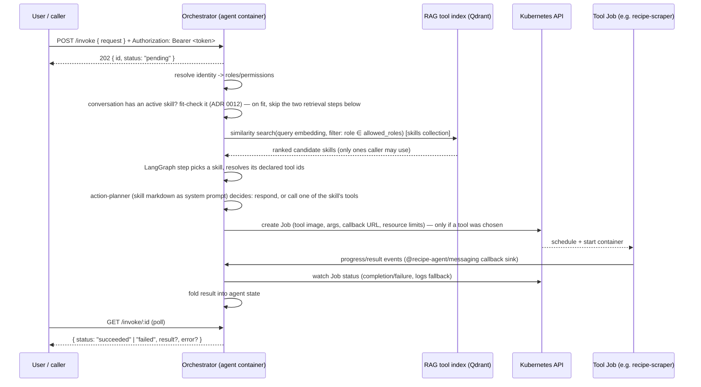

# Agent Orchestrator (design)

> **Status:** first implementation exists at
> [apps/agent-orchestrator/](../apps/agent-orchestrator/) (see its README for
> what's implemented vs. still a known gap). This document describes the
> target architecture referenced throughout [README.md](../README.md),
> [messaging.md](messaging.md), and [security.md](security.md). See
> [docs/adr/](adr/) for the individual decisions and their rationale/alternatives.

The orchestrator is the "brain": a long-lived agent that takes a user request,
decides which tool (or sub-agent) can satisfy it, and launches that work as an
isolated, on-demand container — rather than importing tool code or keeping
tool containers running idle.

## Why a separate orchestrator container

- **Isolation stays symmetric.** Tool containers are already hardened,
  single-purpose, and short-lived ([security.md](security.md)). The
  orchestrator itself should not run inside a tool's process, and a tool
  should never need orchestrator-level cluster permissions. Splitting them
  into separate containers/deployments keeps the RBAC boundary between "can
  reason and launch work" and "can do one job" crisp.
- **Independent lifecycle & scaling.** The orchestrator is a long-lived
  service (handles many requests); tools are ephemeral, bursty Jobs. These
  have different resource/scaling profiles and shouldn't share a container.
- **Blast radius.** If a tool container is compromised (e.g. via prompt
  injection from scraped content), it should not inherit the orchestrator's
  ability to create more Jobs. See [Security considerations](#security-considerations).

## High-level flow

Note: `POST /invoke` and `GET /invoke/:id` are answered by a **separate HTTP
listener** from the Job→orchestrator callback in step 7 above — see
[Consumer-facing HTTP interface](#5-consumer-facing-http-interface) and
[ADR 0006](adr/0006-async-http-invoke-interface.md) for why the interface is
async accept/poll rather than a blocking call, and why it's a different port
than the callback receiver.

## Components

### 1. Agent core — LangGraph.js

The reasoning loop is a LangGraph.js graph, not a hand-rolled loop:

- Nodes (ADR 0008, 0012): resolve-identity → check-active-skill (session
  continuity — skipped straight past when the conversation has no active
  skill) → retrieve-skills (RAG) → select-skill → load-skill-tools →
  plan-action → launch-job (only when the plan calls a tool) → await-result.
- "check-active-skill" (ADR 0012) is the per-turn re-evaluation step: when
  the caller's conversation already has an active skill (see the session
  store under component 7), it re-fetches that skill by id under the
  caller's *current* roles (fail closed) and asks a cheap Structured-Outputs
  fit-check whether the new turn still belongs to it. On a fit it jumps
  straight to load-skill-tools, skipping retrieval + selection; any miss
  falls through to the full RAG path — a miss is never an error.
- "plan-action" is the step that can end the turn without ever launching a
  Job: given the selected skill's markdown as system-prompt context, it
  decides to either respond directly or call one of that skill's declared
  tools — see [Skill layer](#2-skill-layer--tool-registryrag-index) below.
- State carries: original request, caller identity/roles, the selected
  skill + its resolved tools, in-flight job IDs, and accumulated results.
- Sub-agents (below) are modeled as a "launch-job" edge whose target image is
  the orchestrator itself with a narrower task, not a separate code path —
  the graph doesn't need to know the difference between "a tool" and "a
  sub-agent" beyond the Job template it launches.
- The graph itself is transport-agnostic — it's invoked once per request by
  whichever consumer-facing interface calls it (see below).

### 2. Skill layer + tool registry/RAG index

As of ADR 0008, retrieval is two-layered rather than a single flat search over
tools:

- A **`Skill`** sits between the request and tool retrieval: it has its own
  natural-language `description` (embedded, RAG-matched against the request,
  its own Qdrant collection), a `markdown` body injected as system-prompt
  context once selected, and a declared list of `toolIds` it may call
  (optionally empty, for respond-only skills).
- **Skills carry no `allowedRoles` of their own** (ADR 0011 — skills aren't
  dangerous, tools are): a skill's retrieval audience is *derived* at index
  time as the intersection of its tools' `allowedRoles`
  (`src/skills/derive-access.ts`). A caller sees a skill iff they can use
  every tool it declares; a tool-less skill is visible to any caller with a
  resolved identity; a missing/disjoint tool reference fails closed (skill
  visible to no one, logged at startup).
- Once a skill is selected, its `toolIds` are resolved **directly** (no
  re-ranking — `VectorStore.getByIds`, still RBAC re-checked as a
  defense-in-depth backstop), not via a fresh semantic search over the
  whole tool catalog.

Tool selection itself is retrieval-augmented so the agent's context window
only ever sees a short list of *relevant* tools, not the full catalog:

- A **`VectorStore` port** is the only thing the agent core depends on
  (`embed`, `upsert`, `query(text, filter)`). **Qdrant** is the first/only
  adapter, but nothing outside the adapter should import the Qdrant client
  directly — this keeps swapping the backing store later a contained change
  (see [ADR 0003](adr/0003-pluggable-vector-store-qdrant.md)).
- Each indexed record = one tool/sub-agent descriptor: name, natural-language
  description (what gets embedded, including its input/output shape), the
  k8s Job template needed to run it, and **metadata used as a Qdrant payload
  filter**: required role(s)/scope(s), namespace, cost/risk tier.
- **Discovery is a static, build-time manifest per tool** (ADR 0009 —
  supersedes the dynamic cluster-discovery decision in ADR 0004): each tool
  ships a `manifest.json` (id/name/description/input/output/allowedRoles/
  tier/Job template) that gets baked into the orchestrator image at build
  time and loaded once at startup (`ManifestToolRegistry`). This was chosen
  after realizing dynamic Deployment-based discovery had a chicken-and-egg
  problem: tools are only ever launched on demand as one-shot Jobs (ADR
  0005), so there is no live, always-running Deployment to discover in the
  first place — annotating a Deployment would have meant keeping a
  perpetual `replicas: 0` Deployment around purely as discoverable metadata,
  never actually serving traffic. "Register a tool" is now: add
  `tools/<name>/manifest.json`, add one `COPY` line to the orchestrator's
  Dockerfile, rebuild the image.

### 3. RBAC-scoped tool discovery

Which tools even show up as retrieval candidates depends on **who is asking**:

- The orchestrator resolves the caller's identity (from an auth token — exact
  IdP/claims mapping is an open question, see below) into a set of
  roles/scopes *before* querying RAG.
- The similarity search is issued **with a metadata filter** for those
  roles/scopes baked in (Qdrant payload filter), not applied after the fact —
  so an unauthorized tool is never in the LLM's context in the first place,
  and identity-resolution failure fails closed (empty candidate set).
- The same roles/scopes are later used to decide what ServiceAccount /
  permissions the launched Job itself runs with (defense in depth — RBAC is
  checked at retrieval time *and* enforced again at launch time).

### 4. Kubernetes Job launcher

- Uses `@kubernetes/client-node` in-process (`BatchV1Api`) — no shelling out to
  `kubectl`. In-cluster config (mounted ServiceAccount token) in production,
  kubeconfig for local dev.
- One **Job** per tool/sub-agent invocation (not a bare Pod), so retry/backoff
  and TTL cleanup (`ttlSecondsAfterFinished`) come for free.
- Job spec = tool's Job template (image, resource requests/limits, the
  existing hardened container contract from [security.md](security.md): drop
  all capabilities, read-only root filesystem, non-root, no
  privilege-escalation) plus per-call overrides: args/env, and a
  result-callback URL + HMAC secret so the tool container reports back via the
  existing [`@recipe-agent/messaging`](../packages/messaging/) callback sink —
  the orchestrator doesn't need a new result channel, it reuses the protocol
  documented in [messaging.md](messaging.md).
- The orchestrator watches Job/Pod status for completion as a fallback to the
  callback stream (covers crashes that never emit a `failed` event).

### 4b. LocalTool executor sidecars (ADR 0014)

An alternative, lower-latency execution path for lightweight tools that trades
some isolation for speed. A `LocalTool` CR carries a `localExec` spec (runtime +
pinned package coordinate) instead of a Job template, and is executed **in-pod**
rather than as a Job:

- One **executor sidecar per language** (node/python/go/shell) runs alongside the
  orchestrator, reached over a **unix socket** on a shared `emptyDir`
  (`POST /run`, off the network). The orchestrator carries no language toolchains.
- The sidecar fetches+caches the pinned package (integrity-checked, registry
  allowlisted), then runs it under a **per-invocation bubblewrap sandbox**:
  unshared network unless `spec.network` is set, read-only fs + tmpfs `/tmp`,
  cleared env with only the tool's declared env re-injected.
- `secretEnv` is resolved by the orchestrator (which holds the k8s identity) and
  passed to the sidecar over the socket — the sidecars have
  `automountServiceAccountToken: false` and no cluster credentials.
- The tool speaks the same stdio ABI as any LocalTool (input on stdin, one JSON
  envelope on stdout); the executor maps that envelope onto the same
  [`@recipe-agent/messaging`](../packages/messaging/) `Event` the Job path
  produces, so the graph's `launchJob` node treats both identically.

See [ADR 0014](adr/0014-local-tool-sidecar-execution.md) and the
[security.md](security.md) LocalTool section for the isolation trade-offs
(shared pod network namespace, node user-namespace prerequisite, registry code
execution).

### 5. Sub-agents

A sub-agent is the **same orchestrator image**, launched as a Job with a
scoped-down task description and its own (narrower) identity — not a
different codebase. This keeps recursive delegation (agent launches an agent)
consistent with tool launching, at the cost of needing an explicit recursion
depth/cost limit (see below).

### 6. Consumer-facing HTTP interface

How a caller actually reaches the agent (ADR 0006):

- `POST /invoke` (body `{ request }`, `Authorization: Bearer <token>`)
  returns `202 { id, status: "pending" }` immediately rather than blocking —
  the `launchJob` graph step can take as long as the launched tool takes
  (minutes, for something like video transcription), which is a poor fit for
  holding an HTTP connection open.
- `GET /invoke/:id` polls for the current `{ status, result?, error? }`.
- Runs on its **own port**, separate from the Job→orchestrator callback
  listener (component 4 above), so the two can be exposed with different
  network reachability: the invoke port to whoever is allowed to call the
  agent, the callback port only to Job pods in-cluster.
- The bearer token is passed straight through to the graph's
  `resolveIdentity` node (component 3) rather than re-checked at the HTTP
  layer — one place resolves identity, not two.

### 7. OpenAI Chat Completions-compatible facade

A second, thin translation layer on the same port as component 6 (ADR 0007):
`GET /v1/models` and `POST /v1/chat/completions` let any OpenAI-API-compatible
chat client (e.g. Open WebUI) call the agent as if it were a chat model,
without changing the agent graph itself. Streaming (`stream: true`) narrates
LangGraph node transitions (`resolveIdentity → checkActiveSkill →
retrieveSkills → selectSkill → loadSkillTools → planAction → launchJob`) as
chat deltas via `stream(..., { streamMode: "updates" })`, with
an SSE heartbeat filling the gap while `launchJob` blocks on the tool Job;
non-streaming blocks like a plain `/invoke` call would. See ADR 0007 for why
this needed resolving rather than being a drop-in: no multi-turn memory, no
tool-internal progress, structured JSON rendered as a fenced code block, and
per-mode error reporting.

Since ADR 0012 this facade is also where **conversation sessions** attach:
when the request carries Open WebUI's `X-OpenWebUI-Chat-Id` header (sent when
its deployment sets `ENABLE_FORWARD_USER_INFO_HEADERS=true`; `/invoke`
accepts an equivalent optional `session_id` body field), the turn's selected
skill id is remembered in an in-memory session store (sliding TTL) and
offered to the graph's `checkActiveSkill` node on the conversation's next
turn. No conversation id → fully stateless per-turn selection, exactly as
before. The record is bound to the resolved identity subject and stores only
the skill *id* — content is re-fetched RBAC-filtered every turn. Separately,
a bounded window of the prior conversation (both roles, char-capped) is
folded into the request string as a `<conversation_history>` block so
in-progress artifacts — whether tool-extracted or pasted by the user — stay
visible to the planner across turns.

## Security considerations

Extends the threat model in [security.md](security.md); the orchestrator adds
a new privileged actor (it can create Jobs) so these apply on top of the
existing SSRF/prompt-injection mitigations:

- **RBAC is the authorization boundary**, and must fail closed: any failure to
  resolve identity/roles yields zero candidate tools, not an unfiltered
  search.
- **Least-privilege ServiceAccounts.** The orchestrator's own ServiceAccount
  (create/get/watch/delete Jobs, read logs, scoped to a namespace) is distinct
  from the ServiceAccount a launched tool Job runs under. Tool Jobs must not
  themselves have permission to create Jobs unless explicitly launched as a
  sub-agent, and sub-agent depth/fan-out should be capped to bound cost and
  blast radius.
- **Namespace/NetworkPolicy isolation** for launched Jobs, consistent with the
  existing SSRF guard inside tools like `recipe-scraper`.
- **Secrets** (callback HMAC, tool-specific credentials) are injected via k8s
  Secret mounts per Job, never baked into images or passed as plain env in the
  Job spec source.
- **RAG index content is semi-trusted input to the LLM.** Tool descriptions
  sourced from each tool's static manifest (ADR 0009) are themselves
  LLM-visible context; treat them with the same "don't let ingested content
  redirect agent behavior" discipline as scraped content in
  [security.md](security.md) — a manifest is authored by whoever owns that
  tool, which may not be the same person maintaining the orchestrator.
  Skill `description`s (used only for retrieval
  ranking/selection) get the same semi-trusted treatment. Skill `markdown`
  (injected as system-prompt content once a skill is selected) is treated as
  **trusted**, since it's hand-authored by catalog maintainers rather than
  derived from external/caller input — but the action-planner's *output*
  (which tool id to call) is still re-validated against the skill's resolved
  tool list before anything is launched, never trusted blindly (ADR 0008).
- **Skill markdown is not access-controlled content** (ADR 0011): since a
  skill's audience is derived from its tools' roles — and a tool-less skill
  is visible to any authenticated caller — skill markdown must never contain
  secrets or privileged operational detail. RBAC protects what the agent can
  *do* (tools/agents), not what skill instructions a caller might see.
- **Conversation ids are caller-supplied and guessable** (ADR 0012): the
  session record is bound to the identity subject resolved from the bearer
  token, and `checkActiveSkill` treats a subject mismatch as "no session" —
  a guessed chat id can't pull another caller's skill context. Sessions also
  never cache skill content: only the id is stored, and the skill is
  re-fetched under the caller's current roles each turn (fail closed), so a
  role revocation takes effect on the very next message.

## Open questions (explicitly deferred)

- Identity/auth mechanism: which IdP, how tokens map to roles/scopes.
- Embedding model for the RAG index.
- **Manifest staleness** (ADR 0009): the tool catalog only changes when the
  orchestrator image is rebuilt/redeployed with updated `manifest.json`
  files — there's no live drift detection between a manifest and whether
  that tool's image/ServiceAccount actually still exist/are compatible.
  Since ADR 0011 this staleness also applies to **authorization**: skill
  visibility is derived from tool `allowedRoles` at startup, so a role
  change on a Tool only affects which skills a caller can retrieve after an
  orchestrator restart.
- Cross-container observability/tracing (orchestrator ↔ Job).
- Sub-agent recursion depth/cost quotas.
- Multi-skill turns: v1 (ADR 0008) selects a single skill per request; merging
  several matched skills' markdown/tool lists is deferred (reaffirmed by ADR
  0012 — a conversation that pivots *switches* its one active skill, never
  accumulates several).
- Real multi-turn conversation memory: ADR 0012 adds session-scoped **skill
  routing** continuity (which skill a conversation is in), and the chat
  facade folds a bounded window of prior turns into each request — but
  there is no server-side conversation store: anything outside that bounded
  window (or that the chat client doesn't resend) is gone, same underlying
  gap as ADR 0007's "no multi-turn memory."
- Session store scale-out: the ADR 0012 session store is in-memory and
  assumes the chart's default single replica — with multiple replicas,
  sessions fragment across pods (harmless: turns fall back to per-turn
  selection). A shared store (e.g. Redis) behind the same `SessionStore`
  port is the follow-up if the HPA is ever enabled.

## Related

- [ADR index](adr/) — individual decisions and alternatives considered.
- [messaging.md](messaging.md) — event protocol reused for Job → orchestrator
  result reporting.
- [security.md](security.md) — container hardening contract Job templates
  build on.
