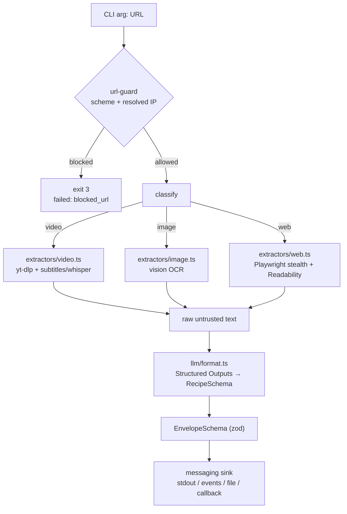

# recipe-scraper

> One tool container in the [recipe-agent](../../README.md) collection. Shared
> conventions (the event protocol and security model every tool follows) live at
> the repo root: [docs/messaging.md](../../docs/messaging.md) and
> [docs/security.md](../../docs/security.md).

A self-contained, security-hardened **subagent container** that turns an
arbitrary URL into a normalized recipe. One URL goes in; a structured recipe
JSON comes out. It is designed to be a single, composable *tool call* so a
parent orchestrator can stay dumb — it just decides *which* tool/subagent to
run, not *how* to scrape.

```
docker run --rm --env-file .env recipe-scraper:latest "https://example.com/some-recipe"
```

```jsonc
{
  "source_type": "video",
  "url": "https://www.youtube.com/watch?v=…",
  "title": "The Juiciest QuesaBirria Tacos At Home (Authentic)",
  "recipe": {
    "ingredients": ["…"],
    "directions": ["…"],
    "equipment": ["…"],
    "tips": "…",
    "tags": ["Mexican", "Tacos", "Birria"]
  },
  "provenance": { "extractor": "yt-dlp", "transcriptSource": "subtitles", "duration": 727 },
  "warnings": []
}
```

---

## Contents

- [What it does](#what-it-does)
- [Quick start](#quick-start)
- [Architecture](#architecture)
- [Extractor lanes](#extractor-lanes)
- [Output contract](#output-contract)
- [Exit codes](#exit-codes)
- [Configuration](#configuration)
- [Security model](#security-model)
- [Development](#development)
- [Troubleshooting](#troubleshooting)
- [Project layout](#project-layout)

---

## What it does

Given a single URL, the container:

1. **Guards** the URL against SSRF (scheme + resolved-IP checks).
2. **Classifies** it into one of three lanes: `video`, `image`, or `web`.
3. **Extracts** raw, untrusted text using the lane-appropriate tool.
4. **Formats** that text into a fixed recipe schema with an LLM constrained by
   OpenAI Structured Outputs.
5. **Emits** the result as a validated JSON envelope (and, optionally, a stream
   of progress events — see [Message passing](../../docs/messaging.md)).

The LLM lives **inside** the container: the container's job is to produce a
consistent artifact from inconsistent inputs, so the parent doesn't have to.

## Quick start

### 1. Configure

```bash
cp .env.example .env
# edit .env and set OPENAI_API_KEY=sk-...
```

The only required secret is `OPENAI_API_KEY` (used for vision OCR, audio
transcription, and recipe formatting).

### 2. Build the image

From the **repo root** (this tool depends on the shared
`@controller-agent/messaging` workspace package, so the build context must include it):

```bash
docker build -f tools/recipe-scraper/Dockerfile -t recipe-scraper:latest .
```

### 3. Run

The `run.sh` wrapper auto-loads `.env` and applies the hardened runtime flags:

```bash
./run.sh "https://www.youtube.com/watch?v=i9X04odxzsM"
```

Equivalent raw command:

```bash
docker run --rm --env-file .env \
  --cap-drop ALL --security-opt no-new-privileges --read-only \
  --tmpfs /tmp:rw,noexec,nosuid,size=512m --pids-limit 512 --memory 2g --cpus 2 \
  recipe-scraper:latest "https://…"
```

## Architecture



**Pipeline stages** (see [src/index.ts](src/index.ts)): `classify` → `extract`
→ `format`. Each stage emits a `progress` event. (`transcribe` is a reserved
stage that happens *inside* the video extractor.)

Key modules:

| Module | Responsibility |
| ------ | -------------- |
| [src/security/url-guard.ts](src/security/url-guard.ts) | SSRF guard: scheme allowlist + resolved-IP block-list, redirect re-validation |
| [src/classify.ts](src/classify.ts) | URL → `video`/`image`/`web` (local host/extension checks, then a guarded HEAD) |
| [src/extractors/](src/extractors/) | One extractor per lane |
| [src/transcription/audio.ts](src/transcription/audio.ts) | Cloud audio transcription |
| [src/llm/format.ts](src/llm/format.ts) | Injection-hardened, schema-constrained recipe formatting |
| [src/schema.ts](src/schema.ts) | `RecipeSchema`, `EnvelopeSchema`, `EventSchema` (the wire contracts) |
| [src/messaging/](src/messaging/) | Thin wiring over the shared [@controller-agent/messaging](../../packages/messaging/) package (`createSink`, redaction-aware `JobEmitter`) |
| [src/util/](src/util/) | Safe subprocess exec + size-capped guarded download |

## Extractor lanes

### Video — [src/extractors/video.ts](src/extractors/video.ts)

Handles YouTube, TikTok, Instagram, Vimeo, and everything else `yt-dlp`
supports. Strategy:

1. Fetch metadata (`title`, `description`, `uploader`) via `yt-dlp -J`.
2. Prefer **subtitles / auto-captions** (cheap, no transcription cost).
3. Fall back to downloading **size-capped audio** (`--max-filesize`, capped by
   `RECIPE_MAX_AUDIO_BYTES`) → cloud Whisper transcription.

Hardening / reliability notes:

- `--ignore-config` prevents a malicious/stray yt-dlp config from injecting
  options.
- `--extractor-args youtube:player_client=default,web_safari,tv,mweb` works
  around YouTube's "Sign in to confirm you're not a bot" gate.
- **Gated content:** set `RECIPE_YTDLP_COOKIES` to a mounted read-only Netscape
  cookies file to pass `--cookies` for login-required videos.

### Image — [src/extractors/image.ts](src/extractors/image.ts)

Downloads the image (SSRF-guarded, capped by `RECIPE_MAX_IMAGE_BYTES`) and uses
a **vision model as an OCR engine** to recover text verbatim. The recovered
text then flows through the same formatting stage as every other lane.

### Web — [src/extractors/web.ts](src/extractors/web.ts)

Loads the page in **headless Chromium with stealth** (`playwright-extra` +
`puppeteer-extra-plugin-stealth`) and extracts the main article text with
Mozilla **Readability**, falling back to the raw body text. Every outbound
browser request is **re-checked against the SSRF guard**, so a page cannot
pivot the browser to an internal address.

## Output contract

The default transport (`RECIPE_TRANSPORT=stdout`) writes **only** the final
recipe envelope (pretty JSON) to stdout — diagnostics go to stderr. The
envelope is validated by `EnvelopeSchema`:

| Field | Type | Notes |
| ----- | ---- | ----- |
| `source_type` | `"video" \| "image" \| "web"` | which lane handled it |
| `url` | string | the input URL |
| `title` | string \| null | best-effort title |
| `recipe.ingredients` | string[] | |
| `recipe.directions` | string[] | ordered steps |
| `recipe.equipment` | string[] | |
| `recipe.tips` | string | |
| `recipe.tags` | string[] | |
| `provenance` | object | non-sensitive extraction metadata |
| `warnings` | string[] | non-fatal issues |

For long-running jobs, progress streaming, durable delivery, and HTTP
callbacks, the container can instead emit an ordered **event stream**
(`accepted → progress* / warning* → succeeded | failed`). That protocol and its
transports are documented in **[docs/messaging.md](../../docs/messaging.md)**.

## Exit codes

The terminal event is authoritative; the exit code is a backstop that lets the
parent branch on failure class without parsing output.

| Exit | `failed.code` | Meaning |
| ---- | ------------- | ------- |
| `0`  | —             | success |
| `2`  | `usage`       | bad invocation (missing URL) |
| `3`  | `blocked_url` | SSRF / scheme guard rejected the URL |
| `4`  | `extraction`  | extractor failed (e.g. yt-dlp error) |
| `5`  | `formatting`  | LLM formatting failed |
| `1`  | `general`     | unexpected error |

## Configuration

All configuration is via environment variables ([src/config.ts](src/config.ts)).

### Core

| Env var | Default | Purpose |
| ------- | ------- | ------- |
| `OPENAI_API_KEY` | — (**required**) | key for vision, transcription, formatting |
| `OPENAI_BASE_URL` | OpenAI default | override for OpenAI-compatible endpoints |
| `RECIPE_IMAGE` | `recipe-scraper:latest` | image tag used by `run.sh` |

### Models

| Env var | Default |
| ------- | ------- |
| `RECIPE_FORMAT_MODEL` | `gpt-4o-2024-08-06` |
| `RECIPE_VISION_MODEL` | `gpt-4o-2024-08-06` |
| `RECIPE_TRANSCRIBE_MODEL` | `whisper-1` |

### Limits & timeouts

| Env var | Default | Purpose |
| ------- | ------- | ------- |
| `RECIPE_MAX_TEXT_CHARS` | `100000` | max chars sent to the formatting LLM |
| `RECIPE_MAX_IMAGE_BYTES` | `15728640` (15 MiB) | image download cap |
| `RECIPE_MAX_AUDIO_BYTES` | `26214400` (25 MiB) | audio download cap |
| `RECIPE_NAV_TIMEOUT_MS` | `30000` | Playwright navigation timeout |
| `RECIPE_SUBPROCESS_TIMEOUT_MS` | `180000` | yt-dlp / ffmpeg timeout |
| `RECIPE_FETCH_TIMEOUT_MS` | `30000` | guarded fetch timeout |
| `RECIPE_MAX_REDIRECTS` | `5` | max redirects for guarded fetch |
| `RECIPE_USER_AGENT` | Chrome UA | UA for fetches & the browser |

### Video

| Env var | Default | Purpose |
| ------- | ------- | ------- |
| `RECIPE_YTDLP_COOKIES` | — | path to a mounted Netscape cookies file for gated content |

### Messaging

Transport selection and callback settings (`RECIPE_TRANSPORT`, `RECIPE_JOB_ID`,
`RECIPE_EVENTS_PATH`, `RECIPE_CALLBACK_*`) are documented in
**[docs/messaging.md](../../docs/messaging.md#configuration)**.

## Security model

This container ingests **attacker-controlled content** (arbitrary URLs → an
LLM), so the two primary threats are **SSRF** and **prompt injection**. The
full threat model and mitigations are in **[docs/security.md](../../docs/security.md)**.
Summary:

- **SSRF guard** blocks non-public addresses (loopback, private, link-local,
  and the cloud-metadata IP `169.254.169.254`) before any fetch, and
  re-validates on every redirect and every browser subrequest.
- **Prompt-injection containment**: scraped text is delimited as data, the
  formatting model has **no tools**, and Structured Outputs constrain it to the
  recipe schema (re-validated with zod).
- **Container as the sandbox boundary**: run non-root with `--cap-drop ALL`,
  `--read-only`, `--security-opt no-new-privileges`, tmpfs `/tmp`, and
  pid/memory/cpu caps (Chromium runs `--no-sandbox` because the container is
  the boundary).
- **Only secret** the container needs is `OPENAI_API_KEY`.

> **DNS-rebinding caveat:** the in-process guard mitigates but cannot fully
> close the resolve-then-connect (TOCTOU) window. For defense in depth, run the
> container on a network whose egress is restricted to public hosts.

## Development

This tool is part of an **npm workspace** rooted at the repo root (so it can
share the [@controller-agent/messaging](../../packages/messaging/) package). Install
and build the shared package once from the repo root, then work in this
directory as usual:

```bash
# from the repo root
npm install
npm run build --workspace=@controller-agent/messaging

# from tools/recipe-scraper/ (or add --workspace=recipe-scraper from the root)
npm run typecheck   # tsc --noEmit
npm test             # vitest
npm run build        # compile to dist/
npm run dev -- "https://…"   # run from source via tsx
```

Requires Node ≥ 20 locally (the image itself runs Node 24 from the Playwright
base).

**Version pinning matters:**

- `playwright` is pinned to an **exact** version in `package.json`, and the
  Dockerfile base image (`mcr.microsoft.com/playwright:vX.Y.Z-jammy`) **must**
  match it exactly, or Chromium won't be found at runtime.
- `yt-dlp` installs the **latest** release by default (YouTube changes often);
  pin via the `YT_DLP_VERSION` build arg for reproducibility.

## Troubleshooting

| Symptom | Cause & fix |
| ------- | ----------- |
| `yt-dlp … Please sign in` / bot gate | Stale yt-dlp and/or the default player client. Rebuild to pull latest yt-dlp; alternate `player_client`s are already configured. For truly gated videos, mount cookies via `RECIPE_YTDLP_COOKIES`. |
| `Invalid response body … Premature close` from the OpenAI SDK | An `openai` SDK version that predates the container's Node runtime (Node 24). Fixed by using `openai@^6`. If you downgrade the SDK, keep it compatible with the base image's Node. |
| `Executable doesn't exist at …headless_shell` | `playwright` npm version drifted from the Dockerfile base image. Pin them to the same version. |
| Blocked URL / exit 3 | The SSRF guard rejected the URL (non-http(s) scheme or a non-public IP). Expected for internal/metadata targets. |

## Project layout

```
.
├── Dockerfile              # multi-stage build; builds FROM THE REPO ROOT
├── run.sh                  # hardened `docker run` wrapper (auto-loads .env)
├── .env.example            # configuration template
├── package.json            # pinned deps + @controller-agent/messaging workspace dep
└── src/
    ├── index.ts            # entrypoint / pipeline orchestration
    ├── config.ts           # env-driven configuration
    ├── classify.ts         # URL → source type
    ├── schema.ts           # recipe / envelope schemas + Stage/ErrorCode types
    ├── extractors/         # video, image, web
    ├── transcription/      # cloud audio transcription
    ├── llm/                # OpenAI client + formatting
    ├── messaging/          # createSink() + JobEmitter wiring over @controller-agent/messaging
    ├── security/           # url-guard, redact
    └── util/               # exec, download
```

The event protocol itself (`Sink`, `JobEmitter`, `StdoutSink`/`FileSink`/`CallbackSink`,
`EventSchema`) lives in the shared, reusable
[packages/messaging](../../packages/messaging/) workspace package — see
[docs/messaging.md](../../docs/messaging.md) for the protocol and
[docs/security.md](../../docs/security.md) for the security model every tool
follows.
